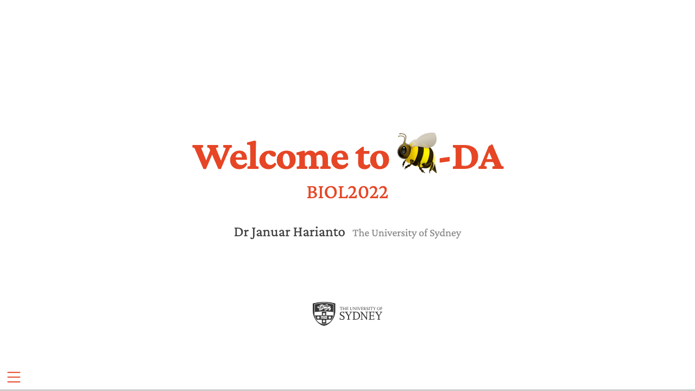
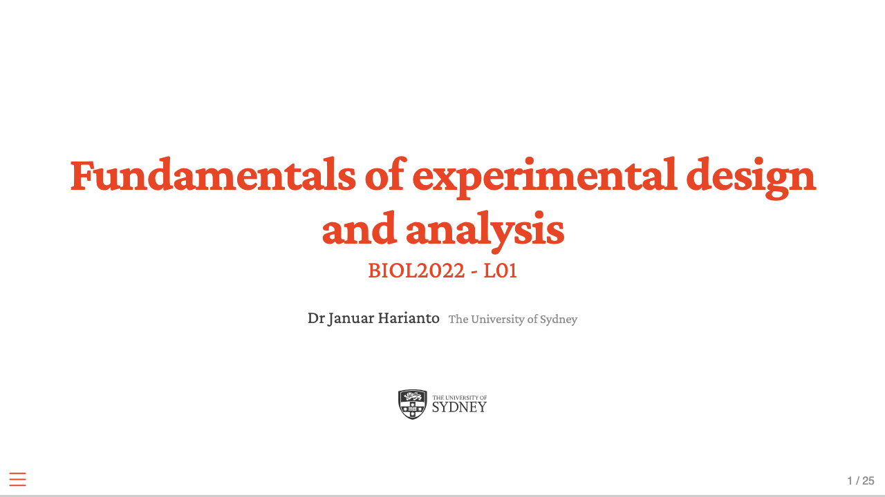
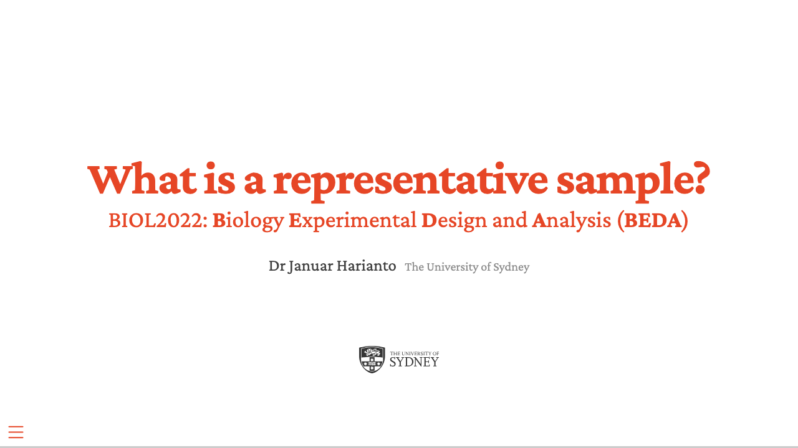
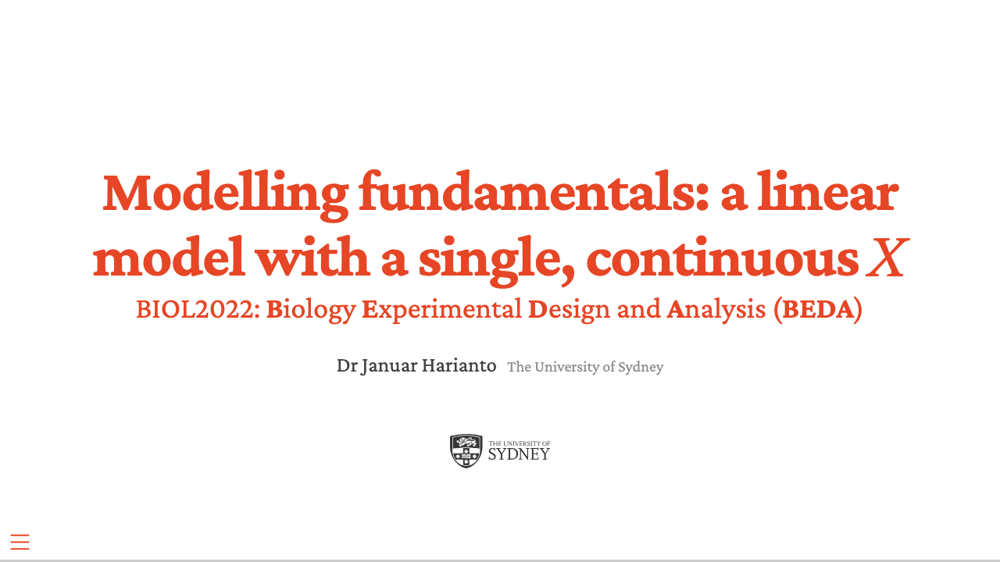
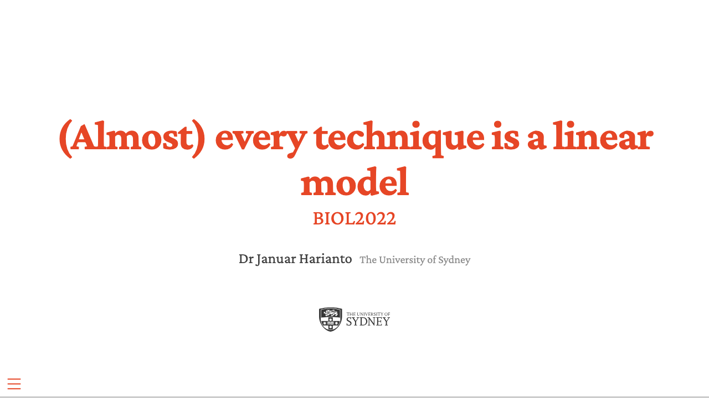

## Week 1: Introduction and fundamentals

<a href="lectures/L00-welcome-to-beda/index.html">Welcome to BEDA</a><a class="lec-pdf" href="lectures/L00-welcome-to-beda/slides.pdf">PDF slides</a>

<a href="lectures/L01-intro-exp-design-analysis/index.html">Fundamentals of experimental design and analysis</a><a class="lec-pdf" href="lectures/L01-intro-exp-design-analysis/slides.pdf">PDF slides</a>

## Week 2: Sampling and modelling

<a href="lectures/L02a-representative-sampling/index.html">Representative sampling</a><a class="lec-pdf" href="lectures/L02a-representative-sampling/slides.pdf">PDF slides</a>

<a href="lectures/L02b-linear-model/index.html">The linear model</a><a class="lec-pdf" href="lectures/L02b-linear-model/slides.pdf">PDF slides</a>

<a href="lectures/L02c-all-linear-model/index.html">All linear models</a><a class="lec-pdf" href="lectures/L02c-all-linear-model/slides.pdf">PDF slides</a>

## Week 3: Assumptions and comparisons

Is my model appropriate?
Coming soon

t-tests
Coming soon

## Week 4: Multiple predictors and transformations

Multiple linear regression
Coming soon

ANOVA
Coming soon

Model transformations
Coming soon

## Week 5: Fixed and random effects

Blocking: fixed and random
Coming soon

Module 1 revision
Coming soon

