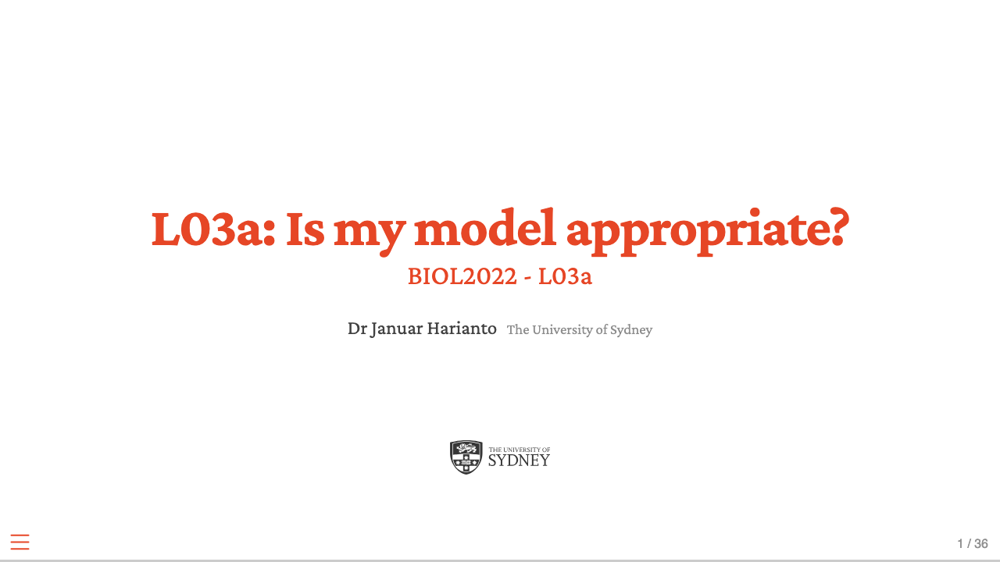
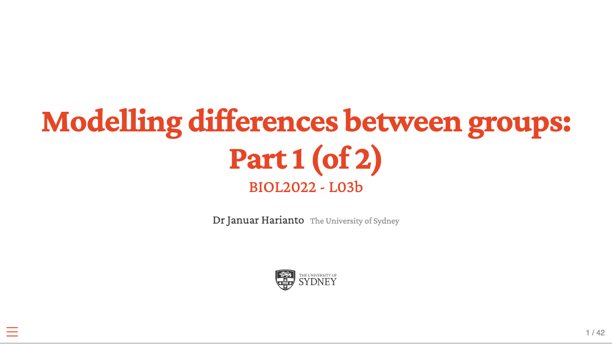
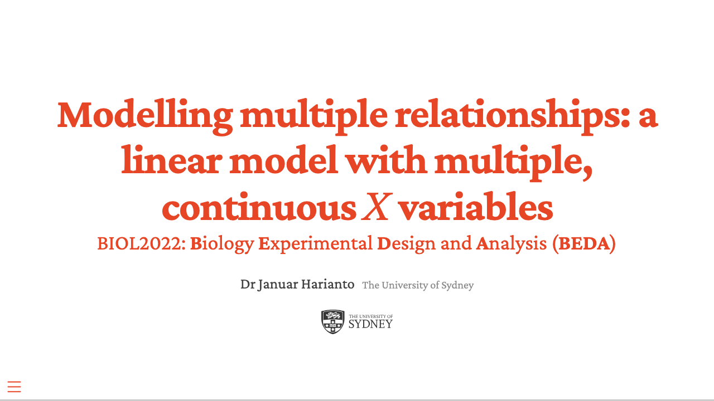
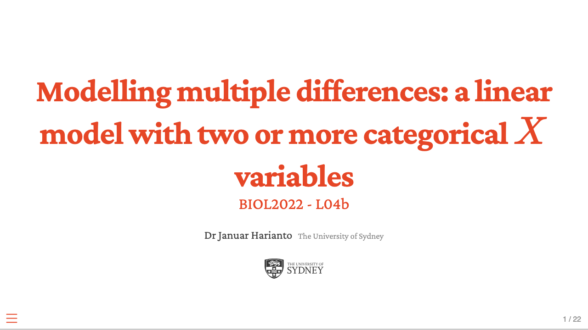
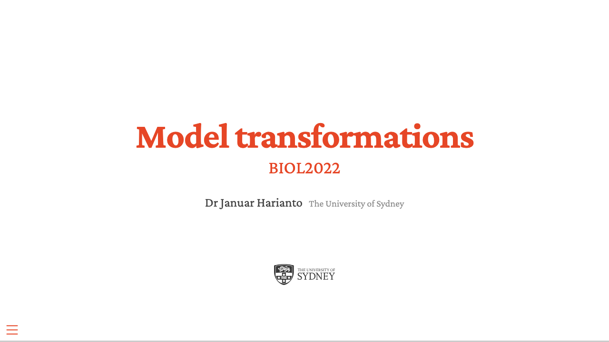
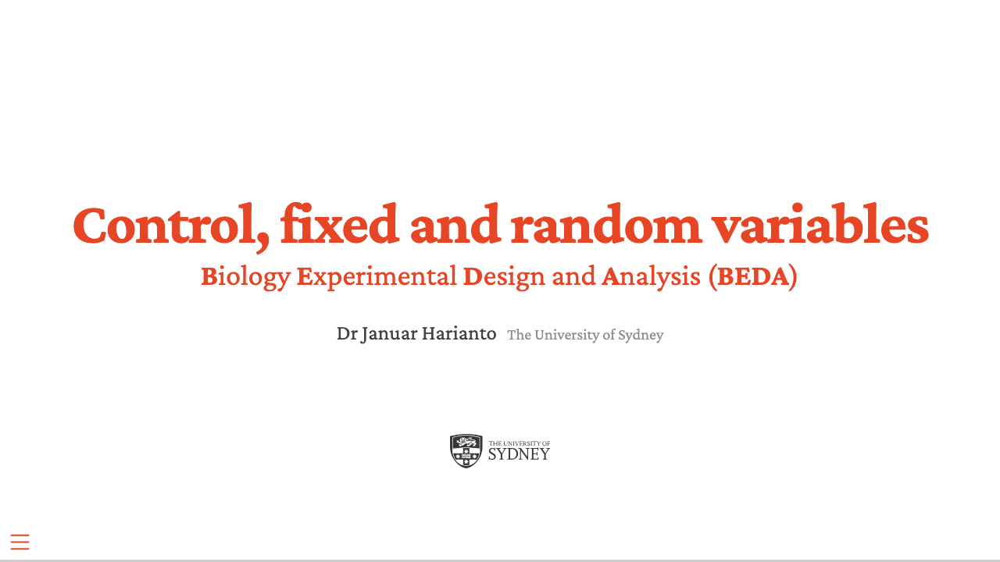
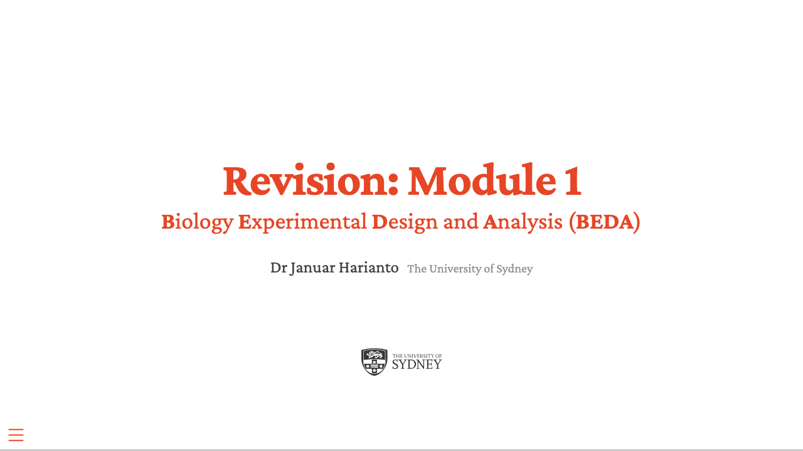

## Week 1: Introduction and fundamentals

<a class="lec-card" href="lectures/L00-welcome-to-beda/index.html">
Welcome to BEDA
</a>
<a class="lec-card" href="lectures/L01-intro-exp-design-analysis/index.html">
Experimental design and analysis
</a>

## Week 2: Sampling and modelling

<a class="lec-card" href="lectures/L02a-representative-sampling/index.html">
Representative sampling
</a>
<a class="lec-card" href="lectures/L02b-linear-model/index.html">
The linear model
</a>
<a class="lec-card" href="lectures/L02c-all-linear-model/index.html">
All linear models
</a>

## Week 3: Assumptions and comparisons

<a class="lec-card" href="lectures/L03a-model-appropriate/index.html">
Is my model appropriate?
</a>
<a class="lec-card" href="lectures/L03b-ttests/index.html">
t-tests
</a>

## Week 4: Multiple predictors and transformations

<a class="lec-card" href="lectures/L04a-mlr/index.html">
Multiple linear regression
</a>
<a class="lec-card" href="lectures/L04b-anova/index.html">
ANOVA
</a>
<a class="lec-card" href="lectures/L04c-model-transformations/index.html">
Model transformations
</a>

## Week 5: Fixed and random effects

<a class="lec-card" href="lectures/L05a-blocking-fixed-random/index.html">
Blocking: fixed and random
</a>
<a class="lec-card" href="lectures/L05b-revision/index.html">
Module 1 revision
</a>

