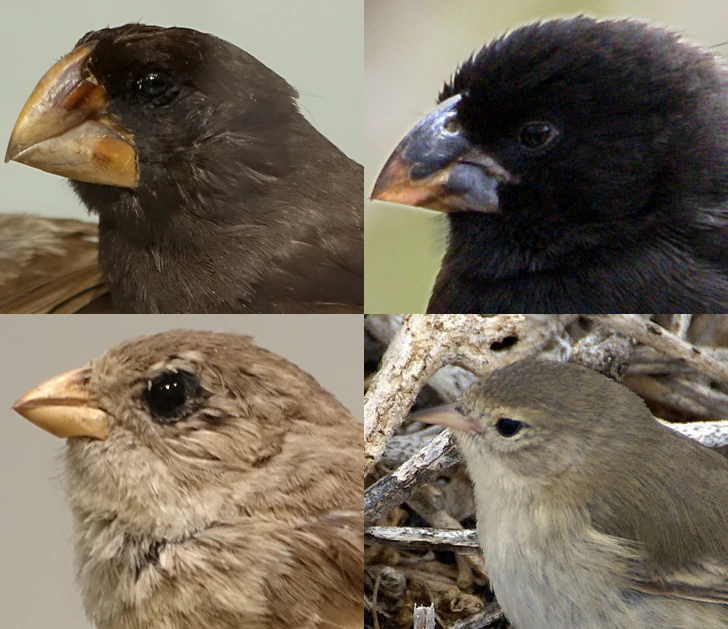
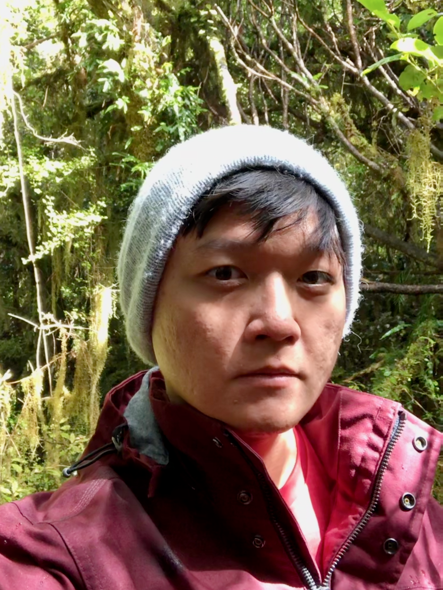
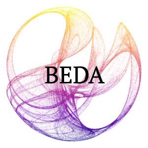
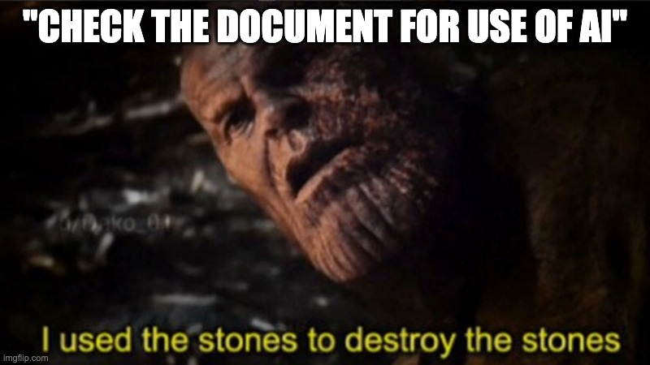
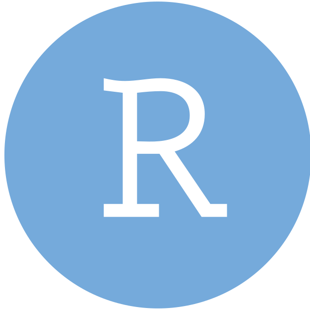
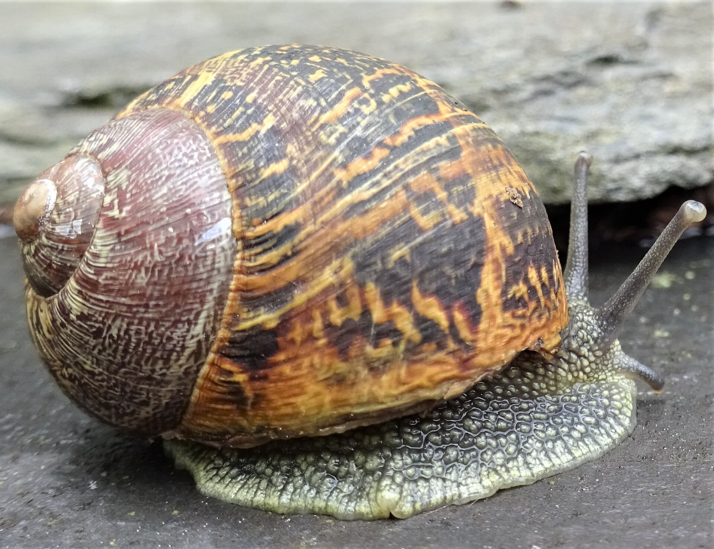

# Biology Experimental Design and Analysis (BEDA)

## Why BEDA?

You are a behavioural ecologist. What questions come to mind?


::: {.incremental}
- What species are we looking at? What interactions are occurring? How can we tell whether this is play-fighting or a serious fight?
- Watson & Croft (1993), [*Playfighting in captive red-necked wallabies, Macropus rufogriseus banksianus*](https://doi.org/10.1163/156853993X00128) (the photograph shows agile wallabies)
:::

## Why BEDA?

You are a casual observer. What questions come to mind when you see this image?



::: {.incremental}
- Why are there so many different beak shapes? Why would different beak shapes be beneficial to the species? How would you compare beaks in terms of how they help the birds live their lives?
- Lamichhaney et al. (2016), [*A beak size locus in Darwin's finches facilitated character displacement during a drought*](https://www.scienceintheclassroom.org/research-papers/search-beak-genes-darwins-finches) (note that we are linking to an article that is based on the research paper, so the title is different)
:::


# Experimental design and analysis is a [core]{.underline} skill for biologists

::: {.fragment}
But also a great crictical thinking skill for anyone in any field
:::

## Why experimental design?

1. **Experimental design** is the process of **planning** an experiment to ensure that the data obtained can provide a valid and objective answer to the **research question**.
2. **Statistical analysis** is the process of **interpreting** and drawing conclusions from the data collected.

Both are essential skills, but one is taught *more* than the other.

::: {.fragment}
### More on this later
:::

# About us

## Your teaching team

```{=html}
<style>
#your-teaching-team .teaching-team {
  display: grid;
  grid-template-columns: repeat(4, 1fr);
  gap: 0.8rem;
  text-align: center;
}

#your-teaching-team .teaching-team img {
  width: 130px;
  height: 170px;
  object-fit: cover;
  margin: 0 auto 0.45rem;
}

#your-teaching-team .teaching-team h3 {
  margin: 0 0 0.2rem;
  font-size: 0.9em;
}

#your-teaching-team .teaching-team p {
  margin: 0.15rem 0;
  font-size: 0.62em;
  line-height: 1.25;
}
</style>

<div class="teaching-team">
  <div>
    
    <h3>Dr Januar Harianto</h3>
    <p><strong>Lecturer in Agricultural Data Science</strong></p>
    <p>Unit coordinator & Module 1</p>
    <p><a href="mailto:januar.harianto@sydney.edu.au">januar.harianto@sydney.edu.au</a><br>C81 Biomedical Building</p>
  </div>
  <div>
    
    <h3>Prof Clare McArthur</h3>
    <p><strong>Professor of Behavioural Ecology</strong></p>
    <p>Module 2</p>
    <p><a href="mailto:clare.mcarthur@sydney.edu.au">clare.mcarthur@sydney.edu.au</a><br>A08 Heydon-Laurence</p>
  </div>
  <div>
    
    <h3>Prof Mathew Crowther</h3>
    <p><strong>Professor</strong></p>
    <p>Module 3</p>
    <p><a href="mailto:mathew.crowther@sydney.edu.au">mathew.crowther@sydney.edu.au</a><br>A08 Heydon-Laurence</p>
  </div>
  <div>
    
    <h3>Dr Gary Truong</h3>
    <p><strong>Senior Technical Officer</strong></p>
    <p>Practical technical support</p>
    <p><a href="mailto:gary.truong@sydney.edu.au">gary.truong@sydney.edu.au</a><br>F07 Carslaw Building</p>
  </div>
</div>
```

## Your tutors and demonstrators

:::: columns
::: column

- Anahi Castillo Angon
- Fiona Clissold
- Gabby Jarvis
- Geoffrey Mazue
- Reilly Seet
- Federico Facchin

:::
::: column

- Alfredo Ortega Gonzalez
- Chloe Hayes
- Anushika Herath
- Toby Champneys
- Chandler Tsz To Tsang
- Ana Pantoja

:::
::::


I may bring some of them in as guests :D


## Resources

```{=html}
<style>
#resources .resource-links {
  display: grid;
  grid-template-columns: repeat(2, 1fr);
  gap: 1.2rem 3rem;
  margin: 1rem auto 0;
  max-width: 760px;
  text-align: center;
}

#resources .resource-link {
  display: flex;
  flex-direction: column;
  align-items: center;
  gap: 0.7rem;
  color: inherit;
  text-decoration: none;
}

#resources .resource-link img {
  width: 170px;
  height: 170px;
  object-fit: contain;
}

#resources .resource-link .platform-mark {
  border-radius: 18px;
}

#resources .resource-link h3 {
  margin: 0;
}
</style>

<div class="resource-links">
  <a class="resource-link" href="https://canvas.sydney.edu.au/courses/74353" target="_blank" rel="noopener">
    
    <h3>Canvas</h3>
  </a>
  <a class="resource-link" href="https://edstem.org/au/courses/36475/discussion" target="_blank" rel="noopener">
    
    <h3>Ed Discussion</h3>
  </a>
  <a class="resource-link" href="https://biol2022.github.io/BEDA-handbook/" target="_blank" rel="noopener">
    
    <h3>BEDA Handbook</h3>
  </a>
  <a class="resource-link" href="https://www.sydney.edu.au/units/BIOL2022" target="_blank" rel="noopener">
    
    <h3>Unit outline</h3>
  </a>
</div>
```


# Expectations


## Learning by osmosis will not work here...


Please check the [Unit Outline](https://canvas.sydney.edu.au/courses/74353/pages/unit-outline) for more details on what you need to do to pass the unit.

## Assessments

[Full assessment details and due dates](https://biol2022.github.io/BEDA-handbook/assessments/assessments.html)

<link rel="stylesheet" href="https://cdn.jsdelivr.net/npm/bootstrap-icons@1.13.1/font/bootstrap-icons.min.css">

<style>
#assessments .bi {
  display: inline-block;
  width: 1.25em;
}
</style>

- <i class="bi bi-lightbulb" aria-hidden="true"></i> **EFT (5%):** a 15-minute online quiz, with feedback before census.
- <i class="bi bi-question-circle" aria-hidden="true"></i> **Quizzes (10%):** a Module 1 evaluation with two attempts; the higher score counts.
- <i class="bi bi-file-earmark-text" aria-hidden="true"></i> **Reports (45%):** tied to the praticals and your data collection. Two reports in total (25% and 20%).
- <i class="bi bi-pencil-square" aria-hidden="true"></i> **Exam (40%):** extended answers (essay). Hurdle task. **If you take report writing seriously you will be well-prepared for the exam.**


- Report submissions are compulsory - **Absent Fail** if either is not submitted.
- **Final exam is a 40% hurdle task.**


## Communication and feedback
- **Announcements and discussions on Ed.**
- Talk to us any time after the lecture, or during practicals.
- **Weekly drop-in sessions** for **questions** and **help**, hosted on Zoom (more details on Ed).
- Each assessment will include feedback to help you improve.


**Q: What do you think is feedback in BEDA?**

# Our policy on AI
Artificial Intelligence.. or Academic Integrity?

## We use it too

AI helped us:

- Create [`tofu`](https://github.com/usyd-soles-edu/tofu), our jamovi module for **multivariate analysis**
- Organise the automated [schedule](https://biol2022.github.io/BEDA-handbook/schedule) in the handbook and the Canvas front page's dynamic week tracker
- Tidy up the handbook (grammar, spelling and structure, as it is based on markup and code)
- Generate some of the interactive content you will see in some lectures
- Generate FAQS for the reports
- Proofread our text from time to time...

## We do NOT use AI to...

- write any practical, lecture or assessment content (including exams) (although proofreading may be done)
- mark your assessments (all our 12 demonstrators will be full hands on deck for marking)
- check your assessments for plagiarism




## Not against Generative AI

- Fine to use as a tool for **learning** - please use it to *support* your thinking.
- Retain ownership of *every decision*. We want you to develop habits that **responsible professionals** use with AI.
- For BEDA, problem solving and critical thinking are what will most help you in the future - so don't let AI take that away from you!

## Discussion - good and bad uses of AI

In general, you can imagine AI as a very capable friend. A good friend will help you learn, but they will not do your work or help you cheat. Which of these requests are reasonable?

- [ ] *Here are the data. Can you decide which analyses to use and write the report for me?*
- [ ] *I have made some basic notes. Can you turn them into a report using these data and the rubric?”*
- [ ] *Can you help me understand this output? I have written down what I think it means, please check?*
- [ ] *Can you proofread my report and tell me whether I have followed the rubric?*
- [ ] *Can you summarise this lecture so I do not need to read the slides?*
- [ ] *Can you explain this concept to me in simpler terms?*
- [ ] *Can you find references for me to support my conclusion so I can add them to my report?*

## Discussion - how will I know if my use of AI is acceptable?

We think it is appropriate if:

- You can explain all the work that has been done if we ask you to.
- You can justify all the decisions you made in your work e.g. why did you interpret the results in a certain way.
- You can claim responsibility for the work that you submit and have adequately explained how you used AI in the acknowledgements section of your report.

## Some interesting articles


::: incremental
- Barcaui (2025), [*ChatGPT as a cognitive crutch*](https://doi.org/10.1016/j.ssaho.2025.102287): *"...unrestricted ChatGPT use impaired long-term retention, likely by reducing the cognitive effort that supports durable memory... while AI assistance may ease initial learning, it appears to undermine the effortful processes needed for robust learning"*
- Dell’Acqua et al. (2026), [*Navigating the jagged technological frontier*](https://doi.org/10.1287/orsc.2025.21838): *"... for a complex managerial task selected to be outside the frontier, subjects using AI were 19% less likely to produce correct solutions compared with those without AI..."*
- Messeri and Crockett (2024), [*Artificial intelligence and illusions of understanding in scientific research*](https://doi.org/10.1038/s41586-024-07146-0): *"The proliferation of AI tools in science risks introducing a phase of scientific enquiry in which we produce more but understand less."*
- Hao et al. (2026), [*AI tools expand scientists’ impact but contract science’s focus*](https://doi.org/10.1038/s41586-025-09922-y): *"... adoption of AI in science presents what seems to be a paradox: an expansion of individual scientists’ impact but a contraction in collective science’s reach, as AI-augmented work moves collectively towards areas richest in data"*
:::

# We have to, so we will (audit)

Be prepared to be *interviewed* on your understanding of **your own reports** with penalties applied. We will also use the practicals to audit your progress from Week 4 onwards.

# Before your first lab...

## Which software should you use?

### Recommended and fully supported

:::: columns
::: column
[{height=80px}](https://cran.r-project.org/)
[{height=80px}](https://positron.posit.co/download)
[{height=80px}](https://posit.co/download/rstudio-desktop/)

#### R in Positron or RStudio

Free, code-based and reproducible.
:::

::: column
[{height=80px}](https://www.jamovi.org/download)

#### jamovi

Free and point-and-click. Analyses can be transferred to R.
:::
::::

### Supported, but not recommended

[{height=80px}](https://www.ibm.com/products/spss-statistics/resources)
[{height=80px}](https://www.primer-e.com/download/)

#### SPSS and PRIMER

Both are proprietary and require a licence, and will need $$$ to maintain once you graduate.


## Help us collect some snails!

<div style="text-align: center;">
<a href="https://canvas.sydney.edu.au/courses/74353/pages/snail-collecting-competition" target="_blank" rel="noopener noreferrer"></a>
<p class="caption" style="font-size: 0.7em;">Click the image to view details. Photograph by <a href="https://commons.wikimedia.org/wiki/File:Cornu_aspersum,_A_Garden_Snail._Chapeltoun._North_Ayrshire._Scotland.jpg">Roger Griffith</a>, <a href="https://creativecommons.org/licenses/by-sa/4.0/">CC BY-SA 4.0</a>.</p>
</div>

# Thanks!

This presentation is based on the [SOLES Quarto reveal.js template](https://github.com/usyd-soles-edu/soles-revealjs) and is licensed under a [Creative Commons Attribution 4.0 International License][cc-by].


<!-- Links -->
[cc-by]: http://creativecommons.org/licenses/by/4.0/
