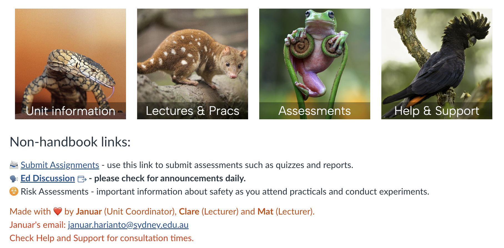
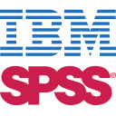

# BIOL2022 in a nutshell 

## Feedback showcase (we are not perfect)

<style>
.feedback-cols{display:flex;gap:16px;align-items:flex-start;}
.feedback-cols .fcol{flex:1 1 0;display:flex;flex-direction:column;gap:14px;}
.feedback-cols .q{padding:12px 16px;background:#fffaf3;border:1px solid #ead9c9;box-shadow:0 6px 16px -12px rgba(0,0,0,.4);border-radius:0;}
.feedback-cols .q .qmark{display:block;background:transparent;color:#e64626;font-family:Georgia,serif;font-size:30px;line-height:.5;margin-bottom:6px;}
.feedback-cols .q p{margin:0;font-size:17px;line-height:1.4;font-style:italic;color:#3a332c;}
.feedback-cols .q p strong{font-style:normal;color:#1f1f24;}
</style>

```{r}
#| results: asis
#| echo: false
q <- readLines("assets/feedback.txt")
q <- trimws(q); q <- q[nzchar(q)]
q <- gsub("\\*\\*(.+?)\\*\\*", "<strong>\\1</strong>", q)
card <- sprintf('<div class="q"><span class="qmark">&ldquo;</span><p>%s</p></div>', q)
cols <- split(card, (seq_along(card) - 1) %% 3)
cat('<div class="feedback-cols">', paste(vapply(cols, function(x) sprintf('<div class="fcol">%s</div>', paste(x, collapse = "")), ""), collapse = ""), '</div>')
```


## Your suggestions matter
:::: {.fragment}
> **I, along with many other fellow students**, were thoroughly **frustrated** with the lack of help on
occasions using softwares such as Jamovi (which was one of the options that we had to use), when
they didn't actually know how to use the software themselves. There was also a lot of software and
skill use of concepts/methods that were never actually explained to us, or if so, very minimally, which
**left us feeling very lost and useless**. That being said, the instructors [redacted], [redacted] and [redacted] were
consistently clear, patient and well informed and actually guided us through exercises.

> I have talked to quite the number of **disgruntled**
classmates though- and I'm sure you've seen some of their survey responses- but I just want to put
my two cents in and say that theres really nothing wrong with the material, assignments, teaching,
etc. **Its just a hard class** that requires a good bit of effort and time and some people *just don't like
that.*

>  The **practicals**. The format was very laid back, tutors were very relaxed when it came to learning.
Questions were returned with a response that was "oh it doesn't really matter." It felt reassuring if
there was a difficulty understanding something but it also was **not helpful in the long run**
::::

# Is there good feedback?

**Yes!**

(This link will only work for the lecturer: [click](https://canvas.sydney.edu.au/courses/67437/files/44775572?module_item_id=2842603))

## We are an *applied* and *practical* unit
- Focus on **interpretation**, *not* complex statistical/mathematical derivations.
- **Software-agnostic**, use any software you like (R, SPSS, Jamovi, etc.) **BUT** some modules will recommend specifics e.g. Module 3 will use PRIMER v7.
- Hands-on with *real* data from real experiments, **practical attendance is mandatory**.


## Canvas site 

- ***All* information on the front page**
- [**Unit Handbook**](https://biol2022.github.io/BEDA-handbook/), your "bible" and a *living* document (PDF available).
- [**Lectures and labs**](https://biol2022.github.io/BEDA-handbook/#schedule), all resources in one place.
- [**Assessments**](https://biol2022.github.io/BEDA-handbook/assessments/assessments.html), all assessment tasks and due dates.
- [**Ed**](https://edstem.org/au/courses/26541/discussion), ask questions, share resources, etc.

:::: {.fragment}
[](https://canvas.sydney.edu.au/courses/67437)
::::


## Modules and assessment


- **Module 1**, study design principles: introduces principles, computer-based labs | **EFT (5%) and Quiz (10%)**
- **Module 2**, univariate experimental design: design and conduct a univariate experiment | **Report 1 (25%)**
- **Module 3**, multivariate study design: design and conduct a multivariate experiment | **Report 2 (20%)**
- **Exam**, written, no MCQ, *up to* 6 questions **(40%) HURDLE TASK** 


# Expectations


## Learning by osmosis will not work here...

:::: {.columns}
:::: {.column width=30%}

::::

:::: {.column}
:::: fragment
###
- **4 hours** of timetabled activities per week (2 lectures, 1 practical).
- **6 hours of self-study per week (minimum)**, based on the University's recommendation of 10 hours per week for a 6 credit point unit.
- Do not leave things to the last minute...
::::
::::

::::


:::: fragment
You must be comfortable with asking questions. **No question is too silly!** Ask on Ed or in-person in the practicals.
::::

## Communication and feedback
- **Announcements and discussions on Ed.**
- Talk to us any time after the lecture, or during practicals.
- **Weekly drop-in sessions** for **questions** and **help**, hosted on Zoom (more details on Ed).
- Each assessment will include feedback to help you improve.

**Email** **Januar** if you have a personal issue or need to discuss something in private.

# Before your first lab...

## Take your pick

:::: columns
:::: column
{height=100px}

[**R**](https://cran.r-project.org/), free, powerful, steep learning curve. Use with [RStudio](https://posit.co/downloads/). You will need to be comfortable with writing `code`.

{height=100px}

**SPSS** (**winding-down support**), user-friendly, expensive, limited. Point and click, no coding required. **Unfortunately, needs licensing.** Use via Citrix or on Lab computers.
::::

:::: column
{height=100px}

[**Jamovi**](https://www.jamovi.org/), free, user-friendly and well-documented. Point and click, limited options but extensible via modules. Analyses are also transferrable to R.

{height=100px}

[**JASP**](https://jasp-stats.org/) (**not supported**), free, user-friendly (more so than Jamovi). Point and click. Not extensible, but has lots of features out of the box (e.g. Bayesian stats).
::::
::::


## I am a beginner, what should I do?

:::: fragment
Use the first practical session this week to test drive the software.
::::

:::: fragment
### 1. Jamovi/R
- Try **Jamovi**, it is free and user-friendly, **and you can always switch to R later.**
- If you do not mind the initial learning curve, **R** will be most beneficial in the long run.

### 2. SPSS
- Go ahead if this is the software you are *most* comfortable with. Licensing is required (but our lab computers have it installed).
::::

:::: fragment
Or, you can use your own software (PSPP, SAS, etc.) as long as you can export your results in a format that we can read in the reports.
::::

 

# Thanks!

This presentation is based on the [SOLES Quarto reveal.js template](https://github.com/usyd-soles-edu/soles-revealjs) and is licensed under a [Creative Commons Attribution 4.0 International License][cc-by].


<!-- Links -->
[cc-by]: http://creativecommons.org/licenses/by/4.0/
