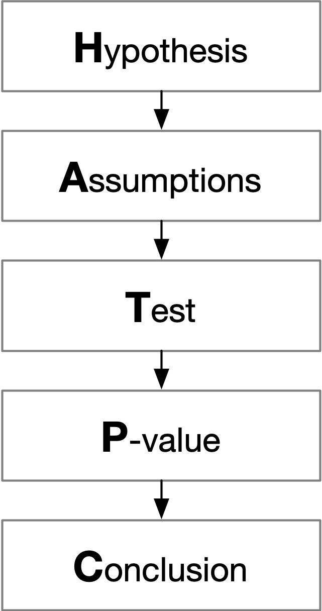
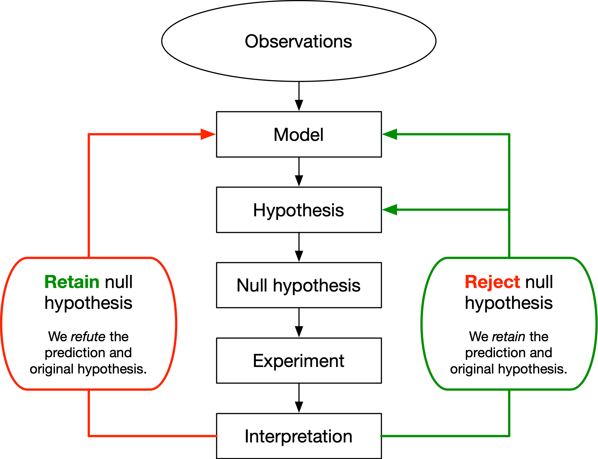
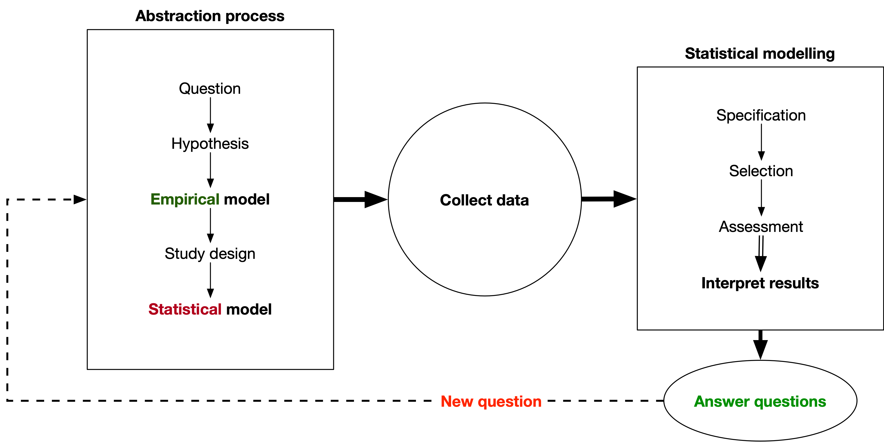
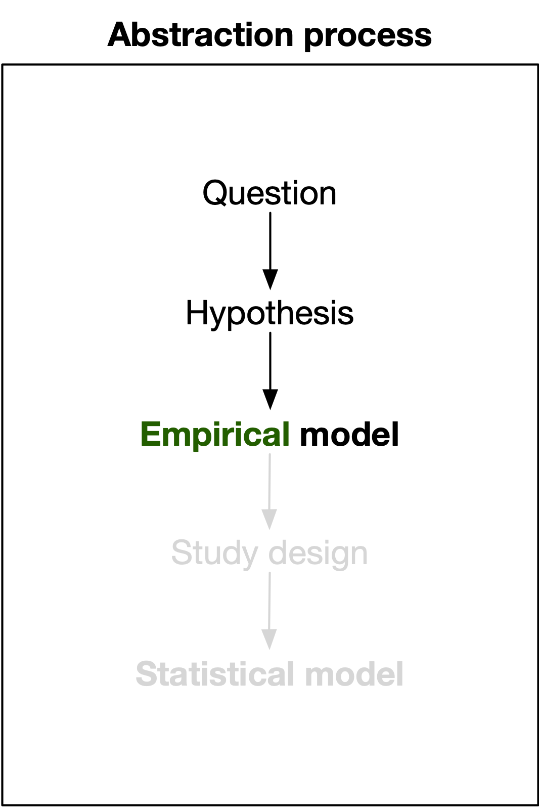
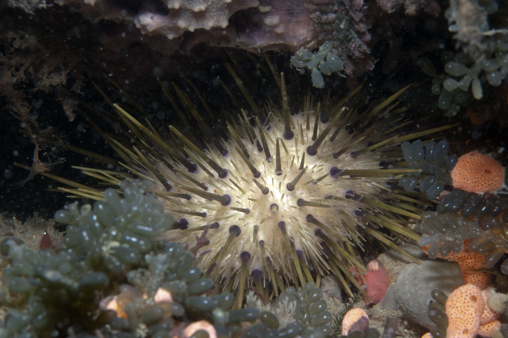

```{r setup}
#| include: false
library(ggplot2)
library(cowplot)

theme_set(theme_cowplot())
```

## Learning outcomes

By the end of this lecture, you should be able to:

1. Explain why planning must happen before data collection.
2. Describe experimental design and analysis as an iterative process.
3. Use a graph to propose a relationship between two variables.
4. Write that relationship as a simple empirical model.

# Workflows?

## HATPC



## Logical framework^1^


^1^Underwood AJ (1997) Experiments in Ecology:  Their Logical Design and Interpretation using Analysis of Variance. Cambridge University Press, Cambridge.

## Experimental design workflow^2^


^3^Fox, G. A., S. Negrete-Yankelevich, and V. J. Sosa. (2015). Ecological statistics: contemporary theory and application. Oxford University Press, USA.

# What do the workflows have in common?
## Planning is *fundamental*
There is no magical statistical method that will make up for a poorly designed study.

<center>
### 🗑️ $Garbage\ in \rightarrow Garbage\ out$ 💩
</center>

::: fragment
### Why do we care?
> *"A single poor design choice can make an experiment nearly worthless."*
>
> -- [Lazic et al. (2018)](https://doi.org/10.1371/journal.pbio.2005282)

> *"Far better an approximate answer to the right question ... than an exact answer to the wrong question."*
>
> -- [John Tukey (1962)](https://doi.org/10.1214/aoms/1177704711)
:::


## Planning the study

We need to think about:

1. What question are we trying to answer?
2. What data would answer that question?
3. What relationship do we expect between the variables?

The relationship we expect is our starting **model**.

We may revisit these decisions as the study develops.


## What are models?


::: fragment
This model retains enough information to describe the terrain without showing any value.

Models:

- focus on relationships between variables.
- help us explain patterns and make predictions.

:::


## Traditional statistics

| Biological question | Predictor | Technique |
|---|---|---|
| Do two groups differ? | Two categories | t-test |
| Do several groups differ? | Several categories | ANOVA |
| Is there a "relationship"? | Continuous measurement | Linear regression |

Many of us have learnt statistics as a set of techniques, often relying some kind of [decision tree](https://statswithcats.net/2010/08/selection-methods-8-21-2010/).

::: fragment
{height=200px}
{height=200px}
:::


## A model-centred view


## A model-centred view

:::: columns

::: {.column width="40%"}
{height=500px}
:::

::: column
<br>

- No data or statistics to worry about (yet)
- Focus on the relationship between variables

::: fragment
::: incremental
1. Question: "Is there a relationship?"
2. Hypothesis: "There is a relationship between the variables."
3. Empirical modelling:
   - **Response** variable is what we want to explain.
   - **Predictor** variable(s) are what we think might explain the response.
:::
:::
::: fragment
The statistical model will *eventually* be a general linear model (GLM) with special cases, but we do not necessarily need to identify the "formal" name.
:::
:::
::::


# Example - sea urchins

[{height=500px}](https://commons.wikimedia.org/wiki/File:Heliocidaris-erythrogramma-red-spined-sea-urchin-tin-mine-cove-victoria-595864-large.jpg)


## Research question

*Heliocidaris erythrogramma* lives on rocky reefs along the NSW coast.

Experiments show that its metabolic rate can be affected by:

- water temperature
- body size
- seawater pH

For now, we will isolate one relationship:

> **How does water temperature affect metabolic rate?**

[Carey et al. (2016)](https://doi.org/10.1242/jeb.136101)


## Building the empirical model

::: columns
::: {.column width="30%"}
{height=500px}
:::

::: {.column width="70%"}
::: {.fragment .incremental}
1. Question: "How does water temperature affect metabolic rate?"
2. Hypothesis: "Metabolic rate will increase as water temperature increases."
3. Empirical model:
   - **Response:** metabolic rate
   - **Predictor:** water temperature
   - **Expected relationship:** positive
:::
:::
:::


## Temperature along a gradient

```{r}
#| code-fold: true
library(readr)
library(dplyr)
library(ggplot2)
urchins <- read_csv("assets/urchin.csv") |>
  mutate(temp_cat = factor(temp_cat, levels = c("low", "med", "high")))

ggplot(urchins, aes(x = temp_cont, y = response)) +
  geom_point() +
  xlab("Temperature") +
  ylab("Metabolic rate")
```

We could expose urchins to a range of temperatures and ask how their metabolic rate changes.

## Temperature as treatment groups

```{r}
#| code-fold: true
ggplot(urchins, aes(x = temp_cat, y = response)) +
  geom_boxplot() +
  xlab("Temperature") +
  ylab("Metabolic rate")
```

Or we could choose a few temperatures and compare metabolic rate among the groups.

## How we define the variable determines the experimental design

Both studies begin with the same biological idea, but they treat temperature differently.

- Across a gradient, we ask how metabolic rate changes with temperature.
- With treatment groups, we ask whether metabolic rate differs among temperatures.

::: fragment
The analyses will look different, but they share the same modelling framework.
:::

## Variables have roles and types

| Variable | Role in the model | How we can represent it |
|---|---|---|
| Metabolic rate | Response | Continuous |
| Temperature | Predictor | Continuous or categorical |

- A variable's **role** describes what it does in the model.
- Its **type** helps determine how we design the study.


## Defining the model 


::: incremental
- $y = f(x)$
- $y$ is influenced by $x$.
- A **response** is influenced by a **predictor**.
- **Metabolic rate** is influenced by **temperature**.
- $\text{Metabolic rate} = f(\text{Temperature})$
- $\text{Metabolic rate} \sim \text{Temperature}$
:::

:::fragment
### The chosen model
$$\text{Metabolic rate} \sim \text{Temperature}$$

- The **response** variable is on the left of the tilde (~).
- The **predictor** variable(s) is on the right of the tilde (~).
- Easy to interpret, modify (e.g. add more predictors) and refer to.
:::

## Designing the study

The design must give us data that can answer the biological question.

- What temperatures will we study?
- What is the experimental unit?
- How will we replicate and randomise?
- What other sources of variation should we measure or control?
- How many independent experimental units do we need?


## The model can grow

Begin with the relationship in our question:

$$\text{Metabolic rate} \sim \text{Temperature}$$

::: fragment
Account for another important biological variable:

$$\text{Metabolic rate} \sim \text{Temperature} + \text{Body size}$$
:::

::: fragment
Add pH if it is part of the question or design:

$$\text{Metabolic rate} \sim \text{Temperature} + \text{Body size} + \text{pH}$$
:::

::: fragment
We add variables because the biology and study design require them, not simply because they are available.
:::


## Just the beginning...

Did we do *any* statistics today?

We will cover more on models and study design in the next few weeks, but I hope you are less intimidated by the process!

**Do not forget...**

<center>
### 🗑️ $Garbage\ in \rightarrow Garbage\ out$ 💩
</center>


# Thanks!

This presentation is based on the [SOLES Quarto reveal.js template](https://github.com/usyd-soles-edu/soles-revealjs) and is licensed under a [Creative Commons Attribution 4.0 International License][cc-by].


<!-- Links -->
[cc-by]: http://creativecommons.org/licenses/by/4.0/
