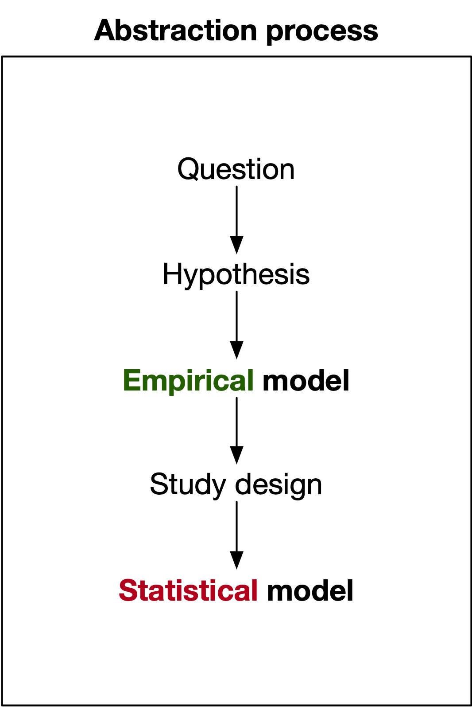
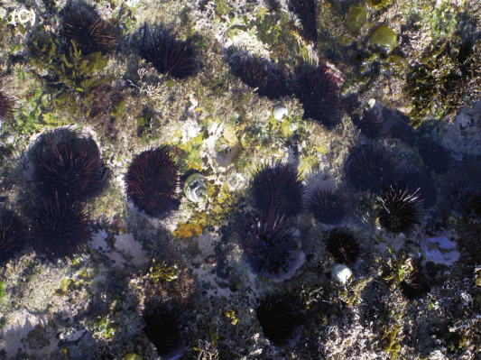

```{r setup}
#| include: false
library(ggplot2)
library(cowplot)

theme_set(theme_cowplot())
```

# Learning outcomes

You should:

1. Understand the importance of *planning* in experimental design and analysis.
2. Appreciate the *iterative* nature of the process.
3. Be able to use visualisation to *guide* the development of a model.
4. Be able to *define* a simple empirical model involving two variables.

# Workflow

## HATPC^1^
{fig-align="center" width=20% height=20%}

^1^Used in DATA1001, ENVX1002 and other units. The University of Sydney.

## Logical framework^2^
{fig-align="center" width=60% height=60%}

^2^Underwood AJ (1997) Experiments in Ecology:  Their Logical Design and Interpretation using Analysis of Variance. Cambridge University Press, Cambridge.

## Experimental design workflow^3^


^3^Fox, G. A., S. Negrete-Yankelevich, and V. J. Sosa. (2015). Ecological statistics: contemporary theory and application. Oxford University Press, USA.

# One thing in common...
## Planning is *fundamental*
There is no magical statistical method that will make up for a poorly designed study.

<center>
### 🗑️ $Garbage\ in \rightarrow Garbage\ out$ 💩
</center>

::: fragment
### Why do we care?
> *“To call in a statistician after the experiment has been done may be no more than asking him to perform a post-mortem examination: he may be able to say what the experiment died of.”*
>
> *“That’s not an experiment you have there, that’s an experience."*
>

-- [Ronald Fisher](https://en.wikipedia.org/wiki/Ronald_Fisher)
:::


## There is no one-size-fits-all
- The process is *iterative* and *non-linear*.
- Different academic disciplines have different approaches but the core principles are the same.
- The key steps are:
  1. Formulate the idea, problem, or question to be addressed.
  2. Think **critically** about what data is needed to answer the question.
  3. Develop a suitable **model** which helps in planning the components of the study.


##  Model?

{fig-align="left"}

::: fragment
- **Models simplify complex data** by capturing the underlying relationships between variables.
- They *condense* information, which allows us to formulate hypotheses and make predictions.
- Just like physical models (e.g. world map), models in statistics are **abstractions** that overlook some details of reality.

**So how do we model data?**
:::


# First, some history
## Traditional statistics
::: fragment
If you have studied statistics before, you might have been taught that:

::: incremental
- Each statistical technique is distinct and separate from the others, and so, e.g. [you need to choose the right one](https://stats.oarc.ucla.edu/other/mult-pkg/whatstat/).
- To make sense of it all, you probably need to refer to a flowchart, e.g. [like this](https://statswithcats.net/wp-content/uploads/2010/08/selection-methods-8-21-2010.png).
:::
:::

::: fragment
{height=180px}
{height=180px}
:::


## Needless complexity: why?


:::: columns
::: {.column width=23%}
{height=150px fig-align="left"}
:::
::: {.column width=14%}
**VS**
:::
::: {.column width=23%}
{height=150px fig-align="left"}
:::
::: {.column}
:::
::::

::: fragment
- The disagreements (to put it mildly) between two superstar statisticians **Karl Pearson** and **Ronald Fisher** shaped the development of statistical techniques such as t-tests, ANOVA, and regression.
- While these techniques have similar mathematical roots, the two had *different* views on the role of mathematical models in statistical inference.
- These differences *may* have contributed to the teaching of statistical techniques that are often presented as **distinct** and **separate** from each other.
- [J. Lenhard, Models and Statistical Inference: The Controversy between Fisher and Neyman–Pearson. The British Journal for the Philosophy of Science 57, 69–91 (2006).](http://stats.org.uk/statistical-inference/Lenhard2006.pdf)
:::


## Dropping the complexity
- It turns out that *most* statistical techniques are based on the **same underlying principles**.
- We can easily observe this with modern statistical software (without doing the math) like R (**more on this next week**).
- It makes learning statistics simpler as well: a **model-centric** approach.


# Empirical modelling 
The process of developing a model that relies on **data** to make predictions, rather than mathematical theory.


## The model-centric approach

... is not a new idea.

> Effective data analysis requires us to consider **vague concepts**, concepts that can be made definite in many ways. To help understand many definite concepts, we need to **go back to more primitive and less definite concepts and then work our way forward**.

-- Mosteller and Tukey (1977)[^1]

::: fragment
It does not have to be *the perfect model* from the start:

- Model the data, even if we do not have a clear idea.
- **Use** the model to *guide* the planning of the study design.
- Iterate the model as we learn *more* about the **limitations** of our study and finalise the **statistical** model.
:::


[^1]: Mosteller, F., & Tukey, J. W. (1977). Data analysis and regression: A second course in statistics. Addison-Wesley.


## Model building basics - a suggested workflow {auto-animate=true}

::: {.columns}
::: {.column width=28%}

:::
::: {.column}
<br> <br>

1. **Formulate the question**: What are you trying to predict?
2. **Generate a hypothesis**: What relationships do you expect to see?
3. **Prototype a model**: What relationships exist between the variables?
4. **Design the study**: replicate, randomise, and control.
5. **Finalise the model**: refine the model based on the study design.
:::
:::


# Example - sea urchins 



## 

{fig-align="center"}

## 

{fig-align="center"}


## Context

1. Urchins inhabit many coastal ecosystems.
2. Some are [keystone](https://education.nationalgeographic.org/resource/role-keystone-species-ecosystem/) species.
3. Understanding the health of urchin populations provides insights into the health of the ecosystem.

::::fragment
It is best to test for *simple* relationships first, before moving on to more complex ones, for complex questions.
::::

:::fragment
### Abstraction (a quick example)

Suppose we want to first benchmark the metabolic rate of sea urchins at different temperatures since health is related to metabolic rate.

::: incremental
- **Question**: How does temperature affect the metabolic rate of sea urchins?
- **Hypothesis**: If temperature increases, the metabolic rate of sea urchins will increase.
- **Model**: ❓❓❓
:::
:::


## The simplest model

```{r}
#| code-fold: true
library(readr)
library(dplyr)
library(ggplot2)
urchins <- read_csv("assets/urchin.csv") |>
  mutate(temp_cat = factor(temp_cat, levels = c("low", "med", "high")))

ggplot(urchins, aes(x = temp_cont, y = response)) +
  geom_point() +
  xlab("Temperature") +
  ylab("Metabolic rate")
```

## The simplest model

```{r}
#| code-fold: true
ggplot(urchins, aes(x = temp_cat, y = response)) +
  geom_boxplot() +
  xlab("Temperature") +
  ylab("Metabolic rate")
```

## Why does visualisation help?

:::fragment
- Visual models **define** the structure of the data and the relationships between variables.
  - Scatter plot: both variables are continuous, we can *perhaps* predict with a linear relationship.
  - Box plot: one variable is categorical and the other is continuous, we can *perhaps* see differences between categories.
:::
::: fragment
- **Implications for study design**:
  - Scatter plot: measure metabolic rates at different temperatures. Aim: to predict.
  - Box plot: measure metabolic rates at fixed temperatures. Aim: to compare.
:::
:::fragment
- Prepares for defining the model empirically, but it all does not *really* matter from that point of view... because both designs are still based on the *same* modelling framework!
:::

## What is a variable?

A **variable** is just anything you can measure or count.

In a study, we usually have two main types:

-   **Response Variable**: The main outcome you are interested in.
    -   *Example*: The **metabolic rate** of our sea urchins.
-   **Predictor Variable**: Something you think might affect the response.
    -   *Example*: The water **temperature** for the urchins.

## Types of variables matter

How you measure a variable changes what you can do with it. A single concept, like temperature, can be treated in different ways.

::: {.columns}
::: {.column width="50%"}
**Categorical (Groups)**

Puts things into boxes.

-   **Nominal**: Boxes with no order.
    -   *Example*: `Colour` (red, blue).
-   **Ordinal**: Boxes with a clear order.
    -   *Example*: We can group precise temperatures into `Temperature Categories` (e.g., 'low', 'medium', 'high').
:::
::: {.column width="50%"}
**Continuous (Numbers)**

A value on a scale.

-   **Interval**: A scale with no true 'zero'.
    -   *Example*: `Temperature` in Celsius is a number (e.g., 14.5°C). 0°C is not 'no temperature'.
-   **Ratio**: A scale with a true 'zero'.
    -   *Example*: `Height` in cm. 0 cm is 'no height'.
:::
:::

::: fragment
### You can often choose the type

It's easy to make a continuous variable categorical (e.g., turn exact `Height` measurements into 'short', 'tall' groups). It's much harder to go the other way.

This choice dictates your next steps:

-   **Graphs**: Use a scatter plot for two continuous variables, but a box plot for a categorical and a continuous one.
-   **Models**: The statistical test you choose depends entirely on your variable types.
:::


## Defining the model 


::: incremental
- $y = f(x)$
- $y$ is influenced by $x$.
- A **response** is influenced by a **predictor**.
- **Metabolic rate** is influenced by **temperature**.
- $\text{Metabolic rate} = f(\text{Temperature})$
- $\text{Metabolic rate} \sim \text{Temperature}$
:::

:::fragment
### The chosen model
$$\text{Metabolic rate} \sim \text{Temperature}$$

- Simple!
- Easy to interpret, modify (e.g. add more predictors) and refer to.
- **Not** a statistical model... yet.
:::

## Time to design the study {auto-animate=true}
Lots of things to consider, where some of the following *might* be relevant:

:::fragment
- **Replication**: to account for variability.
- **Randomisation**: to address bias.
- **Control and blocking**: perhaps to account for confounding or other factors.
- **Sample size**: determines precision, power, and generalisability.
- **Interactions and covariates**: to account for complex relationships.
- **...**
:::

::: fragment
#### Fortunately, the model-centric approach means that we can **iterate** the model as we learn more about the limitations of our study and finalise the statistical model.
:::


## {auto-animate=true}


#### Fortunately, the model-centric approach means that we can **iterate** the model as we learn more about the limitations of our study and finalise the statistical model.

::: fragment
$$\text{Metabolic rate} \sim \text{Temperature}$$
:::

:::fragment
$$\text{Metabolic rate} \sim \text{Temperature} + \text{body size}$$
:::

:::fragment
$$\text{Metabolic rate} \sim \text{Temperature} + \text{body size} + \text{pH}$$
:::


:::fragment
$$\text{Metabolic rate} \sim \text{Temperature} + \text{body size} + (1|\text{pH})$$
:::

:::fragment
$$\text{Metabolic rate} \sim \text{Temperature} + \text{body size} + (1|\text{pH}/\text{Site})$$
:::

:::fragment
All of these models can be incorporated within a unified statistical framework, specifically the **general linear model**.
:::


## Just the beginning...

We will cover more on models and study design in the next few weeks, but I hope you are less intimidated by the process!

**Do not forget...**

<center>
### 🗑️ $Garbage\ in \rightarrow Garbage\ out$ 💩
</center>


# Thanks!

This presentation is based on the [SOLES Quarto reveal.js template](https://github.com/usyd-soles-edu/soles-revealjs) and is licensed under a [Creative Commons Attribution 4.0 International License][cc-by].


<!-- Links -->
[cc-by]: http://creativecommons.org/licenses/by/4.0/


