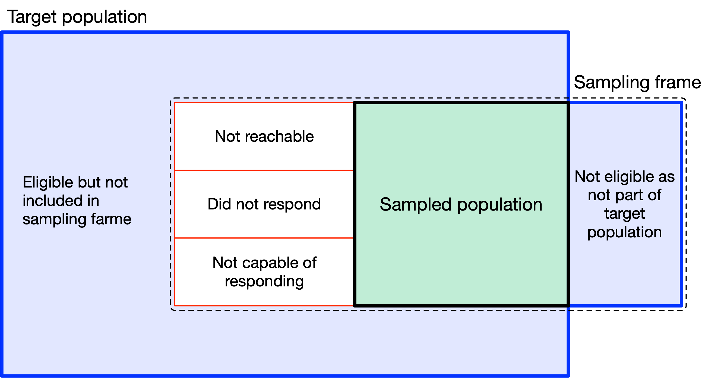
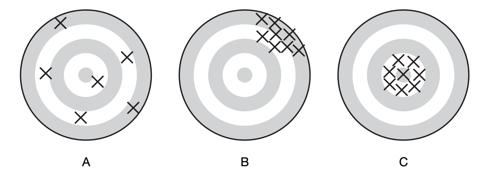
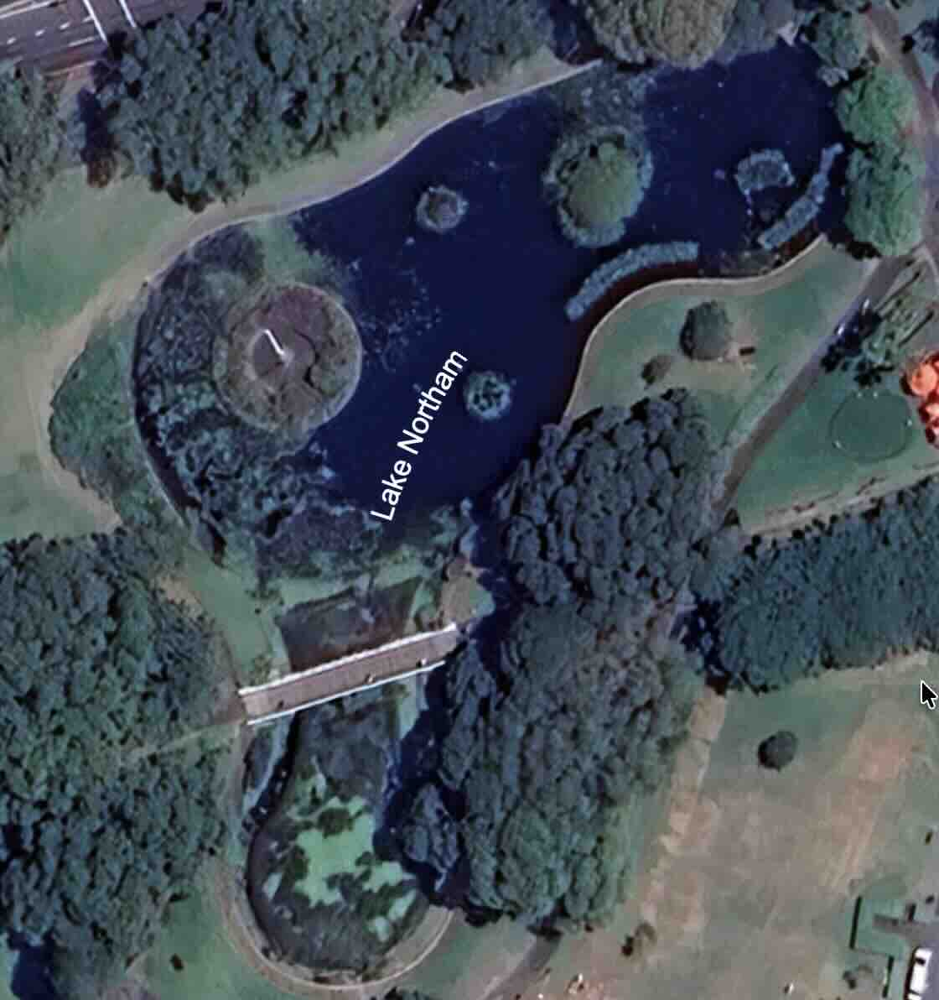
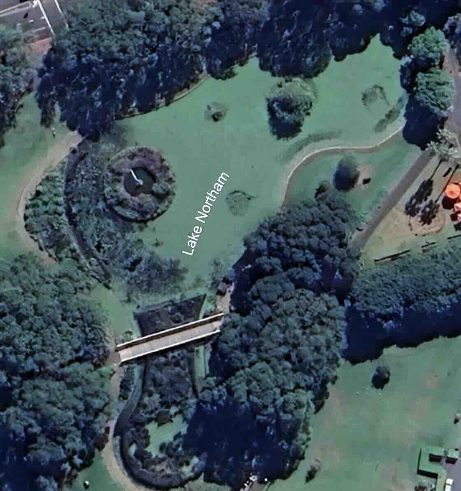
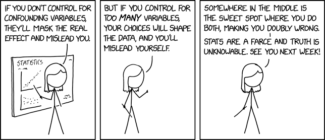
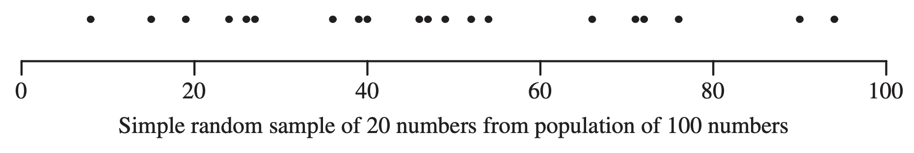
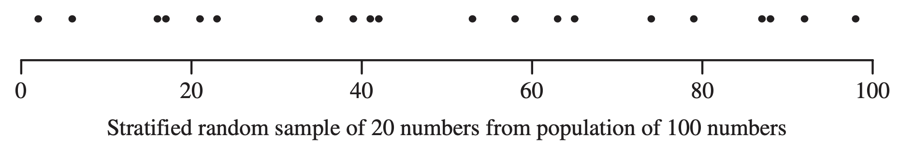
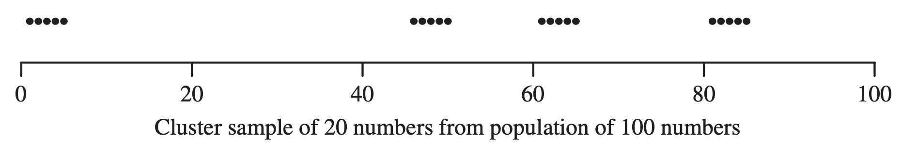
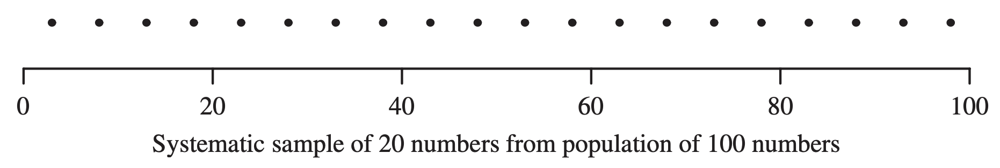

```{r setup}
#| include: false
library(tidyverse)
library(palmerpenguins)
library(patchwork)
library(cowplot)
```

## Sampling


> "I know of scarcely *anything* so apt to impress the imagination as the wonderful form of **cosmic order expressed by the law of frequency of error**.  The law would have been *personified* by the Greeks if they had known of it.
>
> It reigns with serenity and complete self-effacement amidst the *wildest* confusion.  The larger the mob, the greater the apparent anarchy, the more perfect is its sway.  *It is the supreme law of unreason.*"

-- [Sir Francis Galton](https://en.wikipedia.org/wiki/Francis_Galton) (1822 -- 1911), inventor of regression and correlation techniques, on the [*Central Limit Theorem*](https://www.youtube.com/watch?v=zeJD6dqJ5lo) (1889)

::: fragment
**TLDR**: "I am amazed at how, with sampling, the **normal distribution** (*law of frequency of error*) can predict (*express*) phenomena that appear random and irrational".
:::

## Learning objectives

By the end of this lecture, you should be able to:

1. Distinguish clearly between a **population** and a **sample** in a research study.
2. Explain why **representative** sampling is essential for drawing valid conclusions.
3. Select an appropriate sampling method for a given research question and sampling frame.
4. Detect sources of bias, confounding, and pseudoreplication, and explain how each can weaken a study.

# Sampling data for research


<!-- ## Can we estimate the mean from only 10 rectangles?

```{=html}
<div class="rectangle-sampling-game" data-rectangle-sampling-game></div>
<script src="assets/rectangle-sampling.js"></script>
```


## What if the rectangles are in unique groups?

```{=html}
<div class="rectangle-sampling-game" data-stratified-rectangle-game></div>
```
-->


## Population and sample

Consider the following questions:

- What is the population density of possums in the [**University of Sydney**]{style="color:seagreen"}?
- What is the average biomass of fish in a [**large lake**]{style="color:seagreen"}?
- How many species of gastropods are there in different areas of [**Cronulla point, NSW**]{style="color:seagreen"}?

::: fragment
**How do we answer these questions?**
:::

::: fragment
- [**Population**]{style="color:seagreen"}: the entire set of individuals or objects that we are interested in studying.
- **Sample**: a subset of the population that we actually observe or measure.
:::

::: fragment
**Are there differences in answers... depending on how we sample?**
:::


## Sampling considerations

For any population, there will be a **sampling frame** that defines the representativeness of the sample.




## Sampling outcomes

How we sample and how many samples we take can affect the **accuracy** and **precision** of our estimates.

{fig-pos="center"}

- **A**: unbiased but imprecise; the average position is the bull's eye.
- **B**: precise but biased; the average position is away from the bull's eye.
- **C**: accurate and precise; all positions are close to the bull's eye.


# The *representative* sample


## Does phosphorus increase algal growth?

Suppose we observed Victoria Park's [Lake Norham](https://archives.cityofsydney.nsw.gov.au/nodes/view/1971154), which has different algal growth depending on environmental conditions. We wonder if differences in phosphorus (a known nutrient) caused the differences. **How do we even begin to come up with a sampling plan to test this model?**

<style>
#fig-lake-northam .quarto-layout-row {
  justify-content: center;
  gap: 1rem;
}

#fig-lake-northam .quarto-layout-cell {
  flex: 0 0 auto !important;
}

#fig-lake-northam .quarto-float-caption {
  font-size: 0;
}

#fig-lake-northam .source-caption {
  display: block;
  width: 90%;
  max-width: 1100px;
  margin: 0.3rem auto 0;
  padding-top: 0.25rem;
  border-top: 1px solid rgba(255, 255, 255, 0.5);
  font-size: 0.8rem;
  line-height: 1.25;
  text-align: center;
}
</style>

::: {#fig-lake-northam layout-ncol=2}
{height=420px}

{height=420px}

<span class="source-caption">Source: <a href="https://earth.google.com/web/search/Victoria+Park,+Parramatta+Road,+Broadway+NSW/">Google Earth</a>, Victoria Park, Sydney. Imagery dates: 28 February and 30 April 2025. Third-party imagery, excluded from the presentation's <a href="https://creativecommons.org/licenses/by/4.0/">CC BY 4.0 licence</a>. Retain Google's generated on-image attribution.</span>
:::

## Questions to think about

::: incremental

1. What is the population of interest?
2. How do we sample the population?
3. Are the samples independent?
4. How many samples do we need, and what level of precision do we want?
:::

::: fragment
Many of these questions can alter the final model and conclusions - best to consider them *before* collecting data. Why?
:::

## 1. What is the population of interest?

Are we interested in:

- [ ] The entire lake?
- [ ] Only the edge of the lake?

Is the question about:

- The effect of phosphorus on algal growth in:
  - [ ] Different areas of this lake?
  - [ ] All lakes in Sydney?
  - [ ] All lakes in general?

## 2. How do we sample the population?

- Randomly select:
  - [ ] Locations across the lake?
  - [ ] Locations only near the edge of the lake?
  - [ ] Locations only in the sunny part of the lake?
  - [ ] Locations only in the shaded part of the lake?

- How can we measure phosphorus amd algal growth at each location?
  - [ ] Take a water sample and measure phosphorus and algal growth in the lab?
  - [ ] Measure phosphorus and algal growth in situ using onsite equipment?
  - [ ] Use colourimetric methods to measure phosphorus and algal growth in the field?
  - [ ] Do we measure multiple times at each location, or just once, but in more locations?

## 3. Are the samples independent?

If we want to take 20 samples from this lake, how do we ensure that the data from each sample is independent of the others?

**Independence is a core assumption of many statistical tests.** If samples are not independent, the results may be misleading.

Collect 30 samples:

- [ ] from a line transect across the lake, sampling every 5 m?
- [ ] from different locations across the lake using randomly selected coordinates?
- [ ] from the same location(s), but at different times of the day?
- [ ] from the same location, but on different days?
- [ ] from the same location, but need seasonal changes to be considered?

## 4. How many samples do we need?

More samples give more precision, but also cost more time and money. Is there a minimum number of samples that we need to collect to answer the research question?

Will collecting more samples address:

- [ ] Bias?
- [ ] Confounding?
- [ ] pseudoreplication?
- [ ] How well we can estimate true population parameters?
- [ ] How well we can detect a true effect of phosphorus on algal growth?

# Bias, confounding, and pseudoreplication

## Bias

Systematic error that leads to an incorrect estimate of the population parameter. This happens because the sample may not represent the population fairly.

- Are we sampling only from the sunny part of the lake, when the shaded part has different algal growth?
- Are some parts of the lake more accessible than others, and therefore more likely to be sampled?
- Is the sampling method itself not ideal? For example, if we are measuring algal growth using a colourimetric method, is it sensitive enough to detect small differences in algal growth?


::: {.fragment}

The sure way to avoid bias is to use **random sampling** which ensures that every unit in the population has an equal chance of being selected. This is the basis of **probability sampling**.

:::


## Confounding

Often, a **variable** that is associated with both the treatment and the outcome, which can lead to an incorrect conclusion about the relationship between the treatment and the outcome. This is an issue of independence.



- [ ] sunlight?
- [ ] water temperature?
- [ ] water flow?

::: fragment
**Random sampling** can help to reduce the impact of confounding variables. How?
:::

## Pseudoreplication
When multiple measurements are taken from the same experimental unit, but treated as independent replicates. This can lead to an overestimation of the sample size and an underestimation of the variability in the data.

- Is the lake basically one, large experimental unit? If we take multiple samples from the same location, are they truly independent?
- How do we ensure that our samples remain as independent as possible, given the constraints of the lake and our sampling method?

**The issue of pseudoreplication is a debated topic up to this day. What's so difficult about ensuring independence in ecological studies?**


## Further reading (pseudoreplication)

- Hurlbert (1984). [Pseudoreplication and the design of ecological field experiments](https://doi.org/10.2307/1942661).
- [Wikipedia: Pseudoreplication](https://en.wikipedia.org/wiki/Pseudoreplication).
- Davies and Gray (2015). [Discussion of pseudoreplication in natural experiments and ecological monitoring](https://doi.org/10.1002%2Fece3.1782).
- Chaves and Chaves (2010). [An entomologist's guide to pseudoreplication](https://doi.org/10.1093/jmedent/47.1.291).

# Probability sampling

## What is probability sampling?

Sampling methods that rely on the knowledge of the **probability of selection** for each unit in the population that is being sampled. Importantly:

- The probability of selection is **known** and **non-zero** for every unit in the population.
- Randomisation is **crucial** at some stage of the sampling process.
- Selection should **not** be based on convenience, judgement, or availability

## Four probability sampling methods

- **Simple random sampling**: each unit has an equal chance of being selected from the population.
- **Stratified random sampling**: divide the population into groups (strata), then take a random sample from each stratum using a chosen allocation rule.
- **Clustered random sampling**: divide the population into clusters, then randomly select clusters.
- **Systematic sampling**: select a random starting point, then select units at regular intervals from a list.

A common feature of all these sampling methods is that some units are chosen using random selection.

## Simple random sampling

{fig-pos="center"}

Choose individual units at random from a complete sampling frame.

- Every unit has the same chance of selection.
- Use when you want a population-wide estimate and have no useful subgroup information.
- A highly variable population may need a large sample.

## Stratified sampling

{fig-pos="center"}

Divide the population into known, non-overlapping groups, then sample randomly within each group.

- Use when groups are known in advance and differ in the variable of interest.
- Include every group deliberately.
- Proportional allocation keeps the sample composition like the population.
- Stratification can improve precision.


## Some math in stratified sampling

How do we determine how many samples to take from each group? We can use **proportional allocation**:
$$ n_i = \frac{N_i}{N} \times n $$

Here, $n_i$ is the sample size for group $i$, $N_i/N$ is that group's share of the population, and $n$ is the total sample size. A sample of 30 from a population that is 60% A and 40% B includes 18 from A and 12 from B.

## Cluster sampling

{fig-pos="center"}

Choose groups (clusters) at random, then measure all units or sample within the selected groups.

- Use when individual units are difficult to list, but groups can be listed.
- Example: select quadrats to estimate density or biomass.
- Units within a cluster may be similar, so estimates can be less precise than a simple random sample.
- This dependence is expected. It becomes pseudoreplication only if the analysis treats units as independent.

## Systematic sampling

{fig-pos="center"}

Choose a random start, then sample every $k$th unit from a list or stream.

$$ k = \frac{N}{n} $$

Here, $N$ is the population size and $n$ is the sample size. For 100 units and 20 samples, $k = 100/20 = 5$.

- Use when units are easy to order, such as fish passing a fixed point.
- Check for repeating patterns in the order; they can bias the sample.

## Take home message

1. A **representative sample** is essential for drawing valid conclusions about a population.
2. **Probability sampling** methods are the best way to ensure a representative sample.
3. **Randomisation** is crucial to avoid bias and confounding. For pseudoreplication, ensure that samples are independent.

# Thanks!

This presentation is based on the [SOLES Quarto reveal.js template](https://github.com/usyd-soles-edu/soles-revealjs) and is licensed under a [Creative Commons Attribution 4.0 International License][cc-by], except where otherwise noted.

<!-- Links -->
[cc-by]: https://creativecommons.org/licenses/by/4.0/
