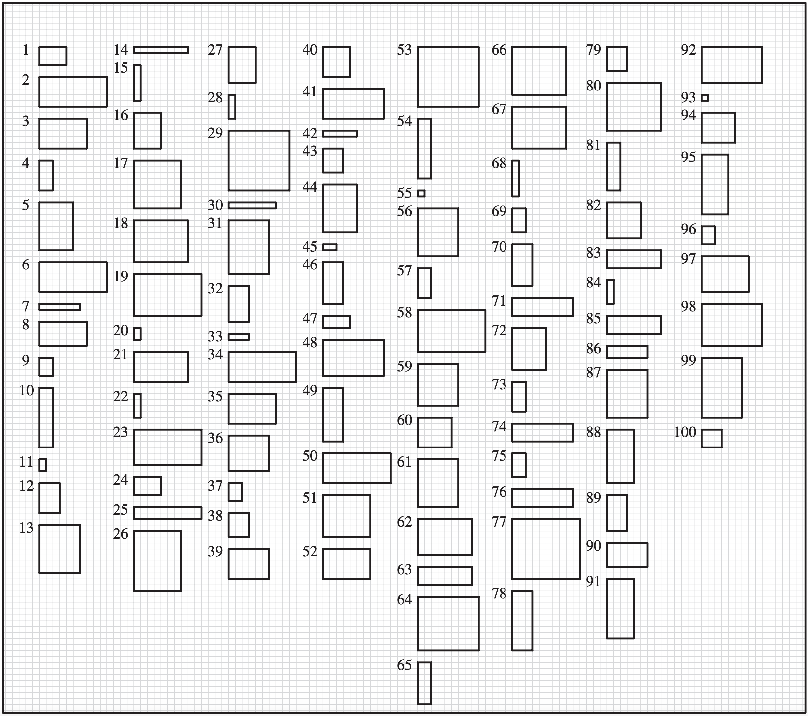
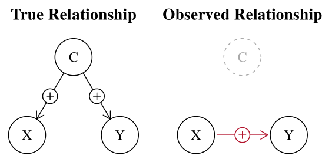
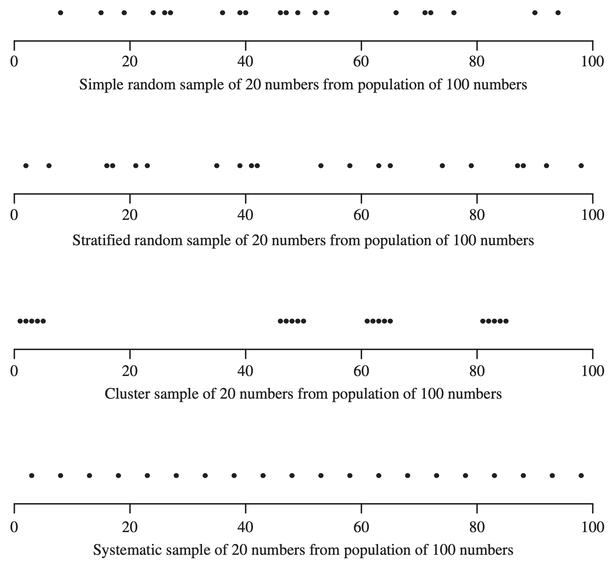

```{r setup}
#| include: false
library(tidyverse)
library(palmerpenguins)
library(patchwork)
library(cowplot)
```

# Learning objectives

You should:

1. [ ] Understand the difference between a population and a sample.
2. [ ] Understand the importance of sampling in research.
3. [ ] If not simple random sampling, be able to choose a sampling method that suits your research question.
4. [ ] Be able to identify and account for bias, confounding, and pseudo-replication in your sampling design.

# Sampling 


> I know of scarcely *anything* so apt to impress the imagination as the wonderful form of **cosmic order expressed by the law of frequency of error**.  The law would have been *personified* by the Greeks if they had known of it.  
>
> It reigns with serenity and complete self-effacement amidst the *wildest* confusion.  The larger the mob, the greater the apparent anarchy, the more perfect is its sway.  **It is the supreme law of unreason.**"

-- [Sir Francis Galton](https://en.wikipedia.org/wiki/Francis_Galton) (1822 -- 1911), inventor of regression and correlation techniques, on the [*Central Limit Theorem*](https://www.youtube.com/watch?v=zeJD6dqJ5lo) (1889)

::: fragment
**TLDR**: "I am amazed at how, with sampling, the **normal distribution** (*law of frequency of error*) can predict phenomena that appear random and irrational". 
:::


## Population and sample

Consider the following research questions:

- What is the population density of possums in the [**University of Sydney**]{style="color:seagreen"}?
- What is the average biomass of fish in a [**large lake**]{style="color:seagreen"}?
- How many species of gastropods are there in different areas of [**Cronulla point, NSW**]{style="color:seagreen"}?

::: fragment
**How do we answer these questions?**
:::
::: fragment
### Some definitions
- [**Population**]{style="color:seagreen"}: the entire set of individuals or objects that we are interested in studying.
- **Sample**: a subset of the population that we actually observe or measure.
:::


## Sampling in a nutshell

](assets/sampling.gif)


## Why sample?


- Cost, practicality, and time constraints.
- Allows us to estimate population parameters without collecting data from the entire population.
- A representative sample provides a great estimate of the population parameter!

::: fragment
### Beware anecdotal evidence

::: columns
::: column
::: fragment
1. What is the population density of possums in the [**University of Sydney**]{style="color:seagreen"}?
2. What is the average biomass of fish in a [**large lake**]{style="color:seagreen"}?
3. How many species of gastropods are there in different areas of [**Cronulla point, NSW**]{style="color:seagreen"}?
:::
:::

::: column
::: fragment
1. I saw one possum in the University in 10 years, so there must be only **one possum** in the University.
2. A man caught four **1.5m long fish** in the lake, so the fish in the lake must be **huge**.
3. My friends found X species of gastropods near the entrance, it must be the same everywhere else.
:::
:::
:::
:::

::: fragment
Data supports these claims, but are they **representative**?
:::


# Choosing a sample

> "In our lust for measurement, we frequently measure that **which we can** rather than that **which we wish** to measure... and forget that there is a difference." 

-- George Udny Yule (1871-1951), British statistician. *Contributor to the theory and practice of correlation, regression, and association, as well as to time series analysis.*


> "The first principle is that you must not fool yourself—and you are the easiest person to fool."

-- [Richard Feynman](https://en.wikipedia.org/wiki/Richard_Feynman), 1918-1988, Nobel Prize-winning physicist


## Sampling considerations


For any population, there will be a **sampling frame** that defines the representativeness of the sample.


## If a population were rectangles...



## Sampling outcomes

{fig-pos="center"}

- **A**: unbiased, average position is the bull's eye. A generalised sample.
- **B**: precise, but biased/inaccurate; average position is not the bull's eye.
- **C**: accurate and precise; all positions are close to the bull's eye.


::: fragment
**Aim: trade-off between A and C.**
:::


# What makes a sample representative?
## Control, randomisation, and replication

- **Control**: minimising the effects of confounding variables.
- **Randomisation**: minimising the effects of bias (and sometimes confounding, if it exists within the sample, not in the population).
- **Replication**: increasing the precision of the estimate.


## What can go wrong?

What can make sampling unrepresentative?

- **Bias**: systematic error in the sample.
- **Confounding**: a variable that is correlated with the variable of interest, but is not a part of the study.
- **Pseudo-replication**: treating non-independent samples as independent, often by accident, but leading to inflated precision. 

::: fragment
#### Control, randomisation, and replication are key to minimising these issues.
:::


## Bias

- Comes in many forms: selection bias, measurement bias, recall bias, etc.
- Can be reduced by using random sampling methods, but not eliminated.
- [[**Blinding**](https://en.wikipedia.org/wiki/Blinded_experiment) and use of controls can help reduce bias in measurement.]{style="color:seagreen"}


::: fragment

### Example
If we are interested in the average weight of fish in a lake, but we only sample fish that are caught by fishermen, we may **underestimate** the average weight of fish in the lake as fishermen are more likely to catch specific (smaller) sizes of fish to meet catch limits.

A *possible* solution is to use a **random sampling** method to select fish for measurement, perhaps using underwater visual surveys, rather than relying on fish caught by fishermen.
:::


## Confounding


  
- Confounding may result in **spurious associations** between variables.
- Can be controlled for by including the variable in the analysis (as a block or covariate), but only if you are **aware** of it!
- In most cases, randomisation is the best way to control for confounding as a good randomisation scheme will ensure that **confounding effects are equally distributed among treatment groups**, but confounding effects that occur in the entire population may still bias the results (e.g. environmental factors).

## Pseudo-replication

- A common "problem" where samples are correlated in some way rather than being independent, e.g. in time or space.
- Often results in an **inflated sample size**, and therefore an inflated sense of precision. 
- Often, the problem occurs as the researcher is **unaware** of the issues, or **unable** to account for them.

::: fragment
### Example

If we sample 10 penguins from 10 different locations for **foraging habits**, we may not have 100 independent samples. Instead we likely have 10 independent samples, as the penguins from the same location may be correlated due to **environmental factors** (e.g. food availability).

A *possible* solution is to increase the number of locations sampled, but decrease the number of penguins sampled per location.

:::


## Resources on pseudo-replication

- Hurlbert (1984). [Pseudoreplication and the design of ecological field experiments](https://doi.org/10.2307/1942661), where the term was coined.
- The usual [Wikipedia](https://en.wikipedia.org/wiki/Pseudoreplication) article.
- Davies and Gray (2015). Don't let spurious accusations of pseudoreplication limit our ability to learn from natural experiments (and other messy kinds of ecological monitoring). [link](https://doi.org/10.1002%2Fece3.1782)
- Chaves and Chaves (2010). An Entomologist Guide to Demystify Pseudoreplication: Data Analysis of Field Studies With Design Constraints. [link](https://doi.org/10.1093/jmedent/47.1.291)


## Handling pseudo-replication

- Need a good understanding of independence between samples. Think about the following:
  - Are the samples independent in time?
  - Are the samples independent in space?
  - Are the samples independent in some other way?
- Always aim for additional treatment or experimental units if possible.
  - For example, for the penguin foraging example, we can increase the number of locations sampled but decrease the number of penguins sampled per location, which preserves sampling effort but increases replication.

At this point you may struggle to detect or account for pseudo-replication, **but it is important to be aware of it.** Aiming for independence between samples is a good start.


# Sampling methods

## Concept

- All units in a population have a known probability of being selected.
- A **random** sample means that each unit in a population has an *equal chance* of being selected.
- A **random number table** or **random number generator** is used to select units.

Anything that is **not** derived from the use of random number generators or tables is *unlikely* to be a product of random sampling.

## Probability sampling

- **Simple random sample** - each unit has an equal chance of being selected from the population.
- **Stratified sample** - divide-and-conquer. The population is first divided into groups (strata), then a simple random sample is taken from each stratum based on its proportion in the population.
- **Cluster sample** - units in the population are grouped into clusters, then a simple random sample of clusters is taken.
- **Systematic sample** - units are selected at regular intervals from a list of all units in the population, but the first unit is selected randomly.

A common feature of all these sampling methods is that, at some point in the process, unit(s) are chosen using random selection.

# Simple random sampling

## Simple random sampling

The most common design.

- The default design for most studies due to its intuitive nature.
- Need large sample sizes for highly variable populations, where other designs may be more efficient.
- Knowing that a sampling unit is in the sample does not affect the probability of another unit being in the sample.


::: fragment
{fig-pos="center"}
:::

## When do we use simple random sampling?

- When we have **no prior knowledge** of the population.
- When the interest is in **generalising** the sample to the population with no interest in subgroups.
- When we have a **sampling frame** of all units in the population.

# Stratified sampling

> "The purely random sample is the only kind that can be examined with entire confidence by means of statistical theory, **but there is one thing wrong with it**. It is so difficult and expensive to obtain for many uses that sheer cost *eliminates* it. A more economical substitute, which is almost universally used in such fields as opinion polling and market research, is called stratified random sampling."

-- Darrell Huff, author of How to Lie with Statistics

## Stratified sampling

We divide the population into "layers" or strata, and then take a simple random sample from each stratum.

- Strata are non-overlapping i.e. each sample belongs to only one stratum.
- Strata are homogeneous i.e. units ***within*** a stratum have equal chance of being selected. 
- Downside is that analysing the data can be more complex.


::: fragment
{fig-pos="center"}
:::


## When do we use stratified sampling?

- When we have **prior knowledge** of the strata in the population.
- To reduce the chance of a "bad pick" during simple random sampling which may lead to **selection bias**.
- To **increase precision** of estimates by reducing the variance of the sample.

### How do we decide the sample size for each stratum?

To ensure our sample is a miniature version of the population, we use **proportional allocation**. This means the proportion of each stratum in our sample is the same as its proportion in the total population. It is the fairest way to represent each group.

We can calculate the required sample size for each stratum using a straightforward formula.

## Calculating sample size for stratified sampling

Suppose I want to collect 30 samples from a population of 120 divided into two strata: A (60% of the population = 72) and B (40% of the population = 48). How many samples should I collect from each stratum?

$$ n_i = \frac{N_i}{N} \times n $$

where $n_i$ is the sample size for stratum $i$, $N_i$ is the population size for stratum $i$, $N$ is the total population size, and $n$ is the total sample size.

::: columns
::: column
$$ n_A = \frac{72}{120} \times 30 = 18 $$
:::

::: column
$$ n_B = \frac{48}{120} \times 30 = 12 $$
:::
:::

The representative sample takes 18 samples from stratum A and 12 samples from stratum B.

# Cluster sampling
> “But averages aren’t real,’’ objected Milo; “they’re just imaginary.’’
>
> “That may be so,’’ he agreed, “but they’re also very useful at times. For instance, if you didn’t have any money at all, but you happened to be with four other people who had ten dollars apiece, then you’d each have an average of eight dollars. Isn’t that right?’’
>
> “I guess so,’’ said Milo weakly.
>
> “Well, think how much better off you’d be, just because of averages,’’ he explained convincingly. “And think of the poor farmer when it doesn’t rain all year: if there wasn’t an average yearly rainfall of 37 inches in this part of the country, all his crops would wither and die.’’
>
> It all sounded terribly confusing to Milo, for he had always had trouble in school with just this subject.
>
> “There are still other advantages,’’ continued the child. “For instance, if one rat were cornered by nine cats, then, on the average, each cat would be 10 per cent rat and the rat would be 90 per cent cat. If you happened to be a rat, you can see how much nicer it would make things.’’

—- Norton Juster, The Phantom Tollbooth

## Cluster sampling

We divide the population into "clusters", and then take a simple random sample of clusters.

- Clusters are non-overlapping i.e. each sample belongs to only one cluster.
- The **entire cluster is sampled** i.e. all units within a cluster are selected.

::: fragment
{fig-pos="center"}
:::

## When do we use cluster sampling?

- When we have **no prior knowledge** of the population.
- When we have a **sampling frame** of clusters, but not of individual units (or it is too expensive or difficult to obtain).


In ecology, we sometimes use "quadrats" as clusters for general assessment of population characteristics such as density and biomass, but this is not always the case (e.g. when we are interested in individual species or individuals).

## Is cluster sampling not just a form of random sampling?

- Not exactly. While both methods involve random selection, cluster sampling focuses on entire groups (clusters) rather than individuals. This can lead to different statistical properties and potential biases. 
- However, the matter of pseudoreplication could cause simple random sampling designs to overestimate the precision of the estimates.


**The following examples are not cluster sampling. Why?**

- You sample 10 penguins from 9 different islands, where no penguin is from the same island.
- You throw a quadrat over a habitat. To assess population density, you divide the quadrat into smaller sections and sample 50% of the sections to estimate the remaining density.

# Systematic sampling

## Systematic sampling

We select units at regular intervals from a list of all units in the population.

- The first unit is selected at random.
- The interval is calculated as the population size divided by the sample size.
- The interval is rounded up to the nearest whole number.
- The next unit is selected by adding the interval to the previous unit.

::: fragment

{fig-pos="center"}

:::

## When do we use systematic sampling?

- When we have a **sampling frame** of all units in the population that is *roughly* in a **random order**.
  - e.g. fish that pass through a location in a river, or birds that fly across a region in the sky.
- Assume that samples obtained behave like a simple random sample.
- Can be a risky design, but useful when we have no other options.

# Comparison



# Putting it into practice

## Quick guide {#quick-guide}

1. Define your research question, model and data structure. **Make sure** you have a clear understanding of your population and sampling frame.
2. Pick a sampling method that suits your model. **Consider the advantages and disadvantages of each method.**
3. Think about **control, randomisation, and replication** in your study design.
4. Update your model and study design, and repeat step 3 if necessary.
5. Start collecting data.


# Thanks!

This presentation is based on the [SOLES Quarto reveal.js template](https://github.com/usyd-soles-edu/soles-revealjs).
