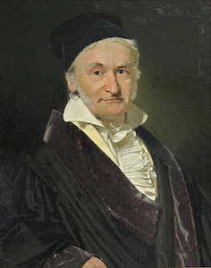
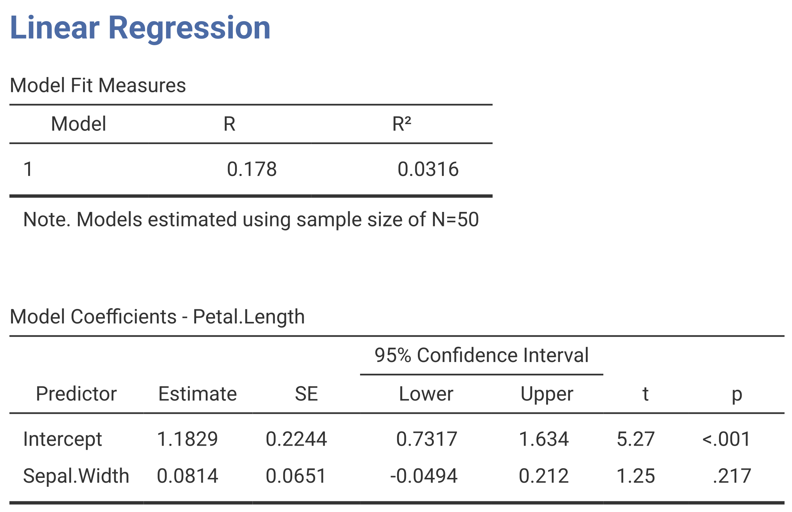

```{r setup}
#| include: false
library(tidyverse)
library(cowplot)
library(gganimate)
library(palmerpenguins)
library(HistData)
library(gt)
library(gtsummary)

style_results_table <- function(table) {
  table |>
    tab_style(
      style = list(
        cell_text(weight = "bold", size = px(24)),
        cell_borders(sides = c("top", "bottom"), color = "black", weight = px(2))
      ),
      locations = cells_column_labels(everything())
    ) |>
    tab_style(
      style = cell_borders(sides = "bottom", color = "black", weight = px(1)),
      locations = cells_body()
    ) |>
    tab_options(
      table.font.size = px(26),
      data_row.padding = px(8),
      table.width = px(1050),
      table.additional_css = "th, td { border-color: black !important; }",
      table.border.top.style = "solid",
      table.border.top.width = px(2),
      table.border.top.color = "black",
      table.border.bottom.style = "solid",
      table.border.bottom.width = px(2),
      table.border.bottom.color = "black",
      column_labels.border.top.style = "solid",
      column_labels.border.top.width = px(2),
      column_labels.border.top.color = "black",
      column_labels.border.bottom.style = "solid",
      column_labels.border.bottom.width = px(2),
      column_labels.border.bottom.color = "black",
      row_group.font.size = px(22),
      row_group.font.weight = "bold",
      row_group.border.top.color = "black",
      row_group.border.bottom.color = "black",
      table_body.hlines.style = "solid",
      table_body.hlines.width = px(1),
      table_body.hlines.color = "black",
      table_body.border.top.color = "black",
      table_body.border.bottom.color = "black"
    )
}
```

## Learning objectives

By the end of this lecture, you should be able to:

- [ ] Describe a linear model for a continuous response and predictor.
- [ ] Write and interpret a simple linear model equation.
- [ ] Interpret coefficients, confidence intervals, and $R^2$ in model output.

## Introduction to linear modelling

> “Cars with flames painted on the hood might get more speeding tickets. Are the flames making the car go fast? No. Certain things just go together. And when they do, they are correlated. **It is the darling of all human errors to assume, without proper testing, that one is the cause of the other.**”

― Barbara Kingsolver, [Flight Behavior](https://en.wikipedia.org/wiki/Flight_Behavior) (2012)

## A short history

::: columns

::: {.fragment .column width=30%}
{height=300px}

**Legendre**: Introduced least squares in 1806. Best image that I could find. Source: [Wikipedia](https://en.wikipedia.org/wiki/Adrien-Marie_Legendre)
:::

::: {.fragment .column width=30%}
{height=300px}

**Gauss**: Published work on least squares in 1809. Source: [Wikipedia](https://en.wikipedia.org/wiki/Carl_Friedrich_Gauss)
:::

::: {.fragment .column width=30%}
{height=300px}

**Galton**: Introduced regression to the mean ([1886](https://galton.org/bib/JournalItem.aspx_action=view_id=157)) and correlation ([1888](https://galton.org/essays/1880-1889/galton-1888-co-relations-royal-soc/galton_corr.html)).
:::

:::

## The Galton dataset (as a quick example)

- 928 children from 205 parent pairs.
- Parent and child heights were recorded in inches.
- Heights were recorded in size classes, so the plot will show horizontal bands.

**Question:** How does child height vary with parent height?

## Scatterplot

```{r}
#| fig-alt: "Scatterplot of child height against parent height, showing a positive but noisy relationship."
p1 <- ggplot(Galton, aes(x = parent, y = child)) +
  geom_point(alpha = .2, size = 3, colour = "firebrick") +
  labs(x = "Parent height (inches)", y = "Child height (inches)") +
  theme_cowplot() +
  geom_blank()
p1
```

We want to explain this *noisy* relationship...

## Regression line

```{r}
#| fig-alt: "Animated scatterplot of child height against parent height. Several straight and curved regression relationships appear in turn before the animation pauses on the fitted straight line."
#| gganimate:
#|   autoplay: true
#|   loop: true
#|   controls: false
#|   muted: true
#| cache: true
x_values <- seq(min(Galton$parent), max(Galton$parent), length.out = 200)
x_centred <- x_values - mean(x_values)
mean_child_height <- mean(Galton$child)
fitted_model <- lm(child ~ parent, data = Galton)

model_sequence <- c(
  "Negative line",
  "Steeper positive line",
  "Curved relationship",
  "Saturating relationship",
  "Fitted regression line"
)

animated_models <- bind_rows(
  tibble(model = model_sequence[1], parent = x_values,
         predicted = mean_child_height - 0.35 * x_centred),
  tibble(model = model_sequence[2], parent = x_values,
         predicted = mean_child_height + 0.75 * x_centred),
  tibble(model = model_sequence[3], parent = x_values,
         predicted = mean_child_height + 0.22 * x_centred^2 - 1.5),
  tibble(model = model_sequence[4], parent = x_values,
         predicted = mean_child_height + 3 * tanh(x_centred / 1.5)),
  tibble(model = model_sequence[5], parent = x_values,
         predicted = predict(fitted_model, newdata = tibble(parent = x_values)))
) |>
  mutate(model = factor(model, levels = model_sequence))

p2 <- ggplot(Galton, aes(x = parent, y = child)) +
  geom_point(alpha = .2, size = 3, colour = "firebrick") +
  geom_line(
    data = animated_models,
    aes(x = parent, y = predicted, group = 1),
    inherit.aes = FALSE,
    colour = "royalblue",
    linewidth = 1.5
  ) +
  labs(x = "Parent height (inches)", y = "Child height (inches)") +
  theme_cowplot() +
  transition_states(
    model,
    transition_length = 1,
    state_length = c(1, 1, 1, 1, 3),
    wrap = TRUE
  ) +
  ease_aes("sine-in-out")

animate(
  p2,
  nframes = 160,
  fps = 20,
  width = 960,
  height = 540,
  units = "px",
  res = 120,
  renderer = ffmpeg_renderer()
)
```

We want to explain this *noisy* relationship... **using a linear model...?**


# How does linear modelling work?

## Least squares

> The method of least squares is the **automobile of modern statistical analysis**: despite its limitations, occasional accidents and incidental pollution, it and its numerous variations, extensions, and related conveyances **carry the bulk of statistical analyses**, and are known and valued by nearly all.

-- Stigler, 1981 (emphasis added)

## Residuals, $\widehat{\epsilon}$

$$Residual = observed − predicted$$
$$ \color{royalblue}{\widehat{\epsilon}_i} = \color{firebrick}{y_i} - \color{forestgreen}{\widehat{y}_i} $$

If a child is 178 cm tall and the fitted line predicts 174 cm, the residual is +4 cm.

. . .

```{r}
#| fig-alt: "Plot showing observations, a fitted line, and vertical residual distances from each observation to the line."
#| code-fold: true
# simulate example data
set.seed(340)
x <- runif(8, 0, 30)
y <- 5 * x + rnorm(8, 0, 40)
df <- data.frame(x, y)

# fit linear model, add residual vertical lines as arrows
mod <- lm(y ~ x, data = df)
p1 <- ggplot(df, aes(x, y)) +
  geom_point() +
  geom_segment(aes(xend = x, yend = fitted(mod)),
    arrow = arrow(length = unit(0.2, "cm")),
    color = "royalblue"
  ) +
  labs(x = "x", y = "y")

p1 +
  geom_smooth(method = "lm", se = FALSE, color = "firebrick") +
  annotate("text",
    x = 6.3, y = -6, size = 7,
    label = expression(hat(epsilon[i])), colour = "royalblue"
  ) +
  annotate("text",
    x = 5.6, y = 25, size = 7,
    label = expression(hat(y[i])), colour = "forestgreen"
  ) +
  annotate("text",
    x = 5.6, y = -36, size = 7,
    label = expression(y[i]), colour = "firebrick"
  ) +
  theme_cowplot()
```


## Using residuals to find the best line

Choose the intercept ($\beta_0$) and slope ($\beta_1$) that make the total squared residual as small as possible:


::: columns
::: {.column width=50%}

](assets/leastsquares.gif){fig-align="left"}

:::
::: {.column width=50%}
###

$$\color{firebrick}{\mathop{\mathrm{arg\,min}}_{\beta_0, \beta_1}} \sum_{i=1}^n (y_i - \color{royalblue}{(\beta_0 + \beta_1 x_i)})^2$$

::: incremental
1. Draw a candidate line.
2. Calculate the residuals.
3. Square and sum them.
4. Find the line with the smallest sum.
5. **Report its slope and intercept.**
:::

:::
:::


# The linear regression

## Model definition

A linear model describes the relationship between a response $y$ and a predictor $x$.

$$y_i = \beta_0 + \beta_1 x_i + \epsilon_i$$

- $\beta_0$: intercept
- $\beta_1$: slope
- $\epsilon_i$: deviation of observation $i$ from the mean response predicted at $x_i$


## Understanding the model {auto-animate="true"}

In the model:

$$y_i = \color{royalblue}{\beta_0 + \beta_1 x_i} + \color{red}{\epsilon_i}$$

The blue component is the fixed mean relationship. The red component is random variation around it.

We can think of the response as being made up of two components:

::: fragment

- Response = [Prediction]{style="color: royalblue"} + [Error]{style="color: red"}
- Response = [Signal]{style="color: royalblue"} + [Noise]{style="color: red"}
- Response = [Deterministic]{style="color: royalblue"} + [Random]{style="color: red"}
- Response = [Explainable]{style="color: royalblue"} + [Everything else]{style="color: red"}

:::


## How do we "explain" a fitted model? {auto-animate="true"}

$$y_i = \color{royalblue}{\beta_0 + \beta_1 x_i} + \color{red}{\epsilon_i}$$

If we were to use plain English, we could say:

> The response variable $y$ changes by $\beta_1$ units for every 1-unit change in the predictor $x$, and the average value of $y$ when $x = 0$ is $\beta_0$. The remaining variation in $y$ is due to random error.


## From model to fitted equation

**The model:**

$$y_i = \beta_0 + \beta_1 x_i + \epsilon_i$$

**After fitting the data:**

$$\widehat{y}_i = \widehat{\beta}_0 + \widehat{\beta}_1 x_i$$

**For Galton's data:**

$$\widehat{child} = 23.94 + 0.65(parent)$$

Once we fit the model, it is now called an estimate (although other terms are also used, such as "fitted value" or "predicted value"), and we no longer have the error term because we are now describing the mean response at each value of $x$.

# Interpretation?

##

```{r}
#| include: false
fit <- lm(child ~ parent, data = Galton)
coefficient <- summary(fit)$coefficients
confidence <- confint(fit)

results <- tibble(
  term = c("Intercept", "Parent height (in)", "R²", "Adjusted R²", "n"),
  estimate_se = c(
    sprintf("%.2f (%.2f)", coefficient[1, 1], coefficient[1, 2]),
    sprintf("%.2f (%.3f)", coefficient[2, 1], coefficient[2, 2]),
    sprintf("%.2f", summary(fit)$r.squared),
    sprintf("%.2f", summary(fit)$adj.r.squared),
    as.character(nrow(Galton))
  ),
  ci = c(
    sprintf("%.2f–%.2f", confidence[1, 1], confidence[1, 2]),
    sprintf("%.2f–%.2f", confidence[2, 1], confidence[2, 2]),
    "", "", ""
  ),
  p = c(
    ifelse(coefficient[1, 4] < 0.001, "<0.001", format.pval(coefficient[1, 4], digits = 2)),
    ifelse(coefficient[2, 4] < 0.001, "<0.001", format.pval(coefficient[2, 4], digits = 2)),
    "", "", ""
  )
)

galton_results_table <- function(
  highlight_terms = character(),
  highlight_columns = names(results)
) {
  table <- results |>
    gt() |>
    cols_label(
      term = "Term",
      estimate_se = "Estimate (SE)",
      ci = "95% CI",
      p = "p-value"
    ) |>
    cols_align(align = "right", columns = c(estimate_se, ci, p)) |>
    tab_row_group(
      label = "Model fit",
      rows = term %in% c("R²", "Adjusted R²", "n")
    ) |>
    tab_row_group(
      label = "Coefficients",
      rows = term %in% c("Intercept", "Parent height (in)")
    ) |>
    style_results_table() |>
    tab_options(
      table.font.size = px(24),
      data_row.padding = px(5),
      table.width = px(1000),
      row_group.font.size = px(20)
    ) |>
    tab_source_note(source_note = "SE = standard error; CI = confidence interval.")

  if (length(highlight_terms) > 0) {
    table <- table |>
      tab_style(
        style = list(
          cell_fill(color = "#FCE8CC"),
          cell_borders(
            sides = c("top", "bottom"),
            color = "#E64626",
            weight = px(3)
          )
        ),
        locations = cells_body(
          columns = all_of(highlight_columns),
          rows = term %in% highlight_terms
        )
      )
  }

  table
}
```

$$\widehat{child} = 23.94 + 0.65(parent)$$

```{r}
#| echo: false
galton_results_table()
```


##

$$\widehat{child} = 23.94 + 0.65(parent)$$


```{r}
#| echo: false
galton_results_table(
  highlight_terms = "Parent height (in)",
  highlight_columns = c("term", "estimate_se")
)
```

A 1-inch increase in parent height corresponds to a 0.65-inch increase in predicted mean child height. This value corresponds to $\widehat{\beta}_1$, the estimated slope of the fitted line.


##

$$\widehat{child} = 23.94 + 0.65(parent)$$

```{r}
#| echo: false
galton_results_table(highlight_terms = "Parent height (in)")
```

- If you see SE, that's the standard error of the estimated slope. It describes how precise the estimate is.
- If you see a 95% CI, that indicates the range of slope values we are confident that if we repeated the experiment many times, 95% of the time the true slope would fall within that range.
- The $p$-value tests the null hypothesis that the slope is zero. A small $p$-value indicates that the slope is unlikely to be zero, and we can conclude that there is a **significant** linear association between parent and child height.


##

$$\widehat{child} = 23.94 + 0.65(parent)$$


```{r}
#| echo: false
galton_results_table(highlight_terms = "Intercept")
```

The intercept is $\widehat{\beta}_0$, the estimated mean child height when parent height is zero. Does this make sense?


##

$$\widehat{child} = 23.94 + 0.65(parent)$$

```{r}
#| echo: false
galton_results_table(
  highlight_terms = c("R²", "Adjusted R²", "n"),
  highlight_columns = c("term", "estimate_se")
)
```

$R^2 = 0.21$ explains that parent height accounts for 21% of the observed variation in child height. Adjusted $R^2$ applies a penalty for model complexity. With one predictor and 928 observations, it remains 0.21. Finally, $n$ is the number of observations used to fit the model.

## Putting the result into words

$$\widehat{child} = 23.94 + 0.65(parent)$$

1. Statistical interpretaion
2. Biological interpretation

::: fragment
> There was a significant, positive linear association between parent and child height (95% CI 0.57–0.73, p < 0.001), and the model accounted for 21% of the variation in child height. A 1-inch increase in parent height corresponded to a 0.65-inch increase in predicted mean child height.
:::


# Practice

## Example: Adelie penguins

```{=html}
<style>
#example-adelie-penguins pre {
  max-height: 580px !important;
  overflow-y: visible !important;
}
</style>
```

```
lm(formula = body_mass_g ~ flipper_length_mm, data = penguins)

Residuals:
    Min      1Q  Median      3Q     Max
-875.68 -331.10  -14.53  265.74 1144.81

Coefficients:
                   Estimate Std. Error t value Pr(>|t|)
(Intercept)       -2535.837    964.798  -2.628  0.00948 **
flipper_length_mm    32.832      5.076   6.468 1.34e-09 ***
---
Signif. codes:  0 '***' 0.001 '**' 0.01 '*' 0.05 '.' 0.1 ' ' 1

Residual standard error: 406.6 on 149 degrees of freedom
  (1 observation deleted due to missingness)
Multiple R-squared:  0.2192,    Adjusted R-squared:  0.214
F-statistic: 41.83 on 1 and 149 DF,  p-value: 1.343e-09
```

-----

```{r}
ggplot(penguins, aes(x = flipper_length_mm, y = body_mass_g)) +
  geom_point(alpha = 0.5) +
  geom_smooth(method = "lm", se = FALSE, color = "firebrick") +
  labs(
    x = "Flipper length (mm)",
    y = "Body mass (g)"
  ) +
  theme_cowplot()
```


## Example: *Iris setosa*

{fig-alt="Jamovi linear regression output for petal length predicted by sepal width in 50 Iris setosa observations." width=760px}

-----

```{r}
ggplot(iris, aes(x = Sepal.Width, y = Petal.Length)) +
  geom_point(alpha = 0.5) +
  geom_smooth(method = "lm", se = FALSE, color = "firebrick") +
  labs(
    x = "Sepal width (cm)",
    y = "Petal length (cm)"
  ) +
  theme_cowplot()
```

## Example: Air quality data

```{r}
#| echo: true
#| code-fold: true
# Remove missing values and fit linear model
air_clean <- airquality |> filter(!is.na(Solar.R), !is.na(Wind))
fit_air <- lm(Wind ~ Solar.R, data = air_clean)

air_summary <- summary(fit_air)
air_coefficients <- air_summary$coefficients
air_confidence <- confint(fit_air)

tibble(
  term = c("Intercept", "Solar radiation (Langley units)"),
  estimate_se = sprintf(
    "%.3f (%.3f)",
    air_coefficients[, "Estimate"],
    air_coefficients[, "Std. Error"]
  ),
  ci = sprintf("%.3f to %.3f", air_confidence[, 1], air_confidence[, 2]),
  p = format.pval(air_coefficients[, "Pr(>|t|)"], digits = 2, eps = 0.001)
) |>
  gt() |>
  cols_label(
    term = "Term",
    estimate_se = "Estimate (SE)",
    ci = "95% CI",
    p = "p-value"
  ) |>
  cols_align(align = "right", columns = c(estimate_se, ci, p)) |>
  tab_source_note(
    source_note = sprintf(
      "Model fit: R² = %.3f; adjusted R² = %.3f; n = %d.",
      air_summary$r.squared,
      air_summary$adj.r.squared,
      nobs(fit_air)
    )
  ) |>
  style_results_table()
```

-----


```{r}
ggplot(air_clean, aes(x = Solar.R, y = Wind)) +
  geom_point(alpha = 0.5) +
  geom_smooth(method = "lm", se = FALSE, color = "firebrick") +
  labs(
    x = "Solar radiation (Langley units)",
    y = "Wind speed (mph)"
  ) +
  theme_cowplot()
```


## A fitted model is not automatically a good model

Any dataset can be given a fitted straight line, but that does not mean the line describes the data well.

::: fragment


:::

## Next week: model assumptions

We will explore the assumptions of linear regression and learn how to assess whether they are reasonable for our data.

# Thanks

This presentation is based on the [SOLES Quarto reveal.js template](https://github.com/usyd-soles-edu/soles-revealjs) and is licensed under a [Creative Commons Attribution 4.0 International License][cc-by].


<!-- Links -->
[cc-by]: http://creativecommons.org/licenses/by/4.0/
