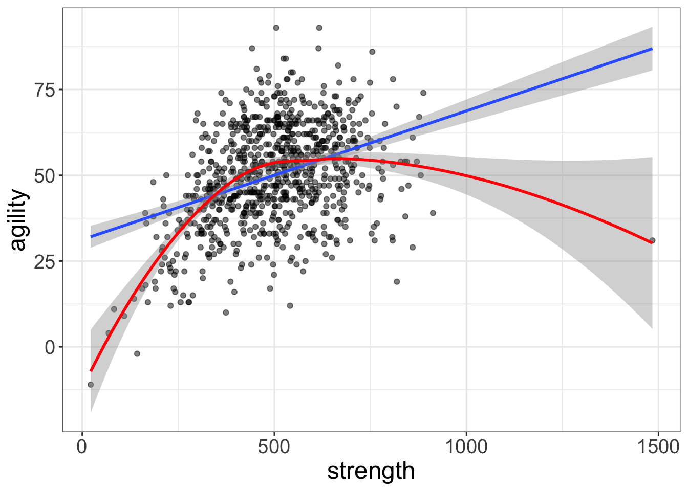

```{r}
#| include: false

library(HistData)
library(tidyverse)
library(cowplot)
library(ggfortify)
library(patchwork)
library(broom)
library(gt)
library(gtsummary)
```

## (Statistical) models

> I remember a remark of Albert Einstein, which certainly applies to music. He said, in effect, that everything should be as simple as it can be, but not simpler.

-- Roger Sessions (1950), [How a ‘Difficult’ Composer Gets That Way](https://books.google.com.au/books?id=prDfAFjet9cC&pg=PA230&lpg=PA230&dq=roger+sessions+einstein+simple&ots=Pz4qMxh5is&sig=FLJB2lTfDvIzRU3MKObDNfw0MiY&hl=en&oi=book_result&ct=result&redir_esc=y#v=onepage&q=roger%20sessions%20einstein%20simple&f=false) 

## Stay with me!

- Do not let the mathematical notation scare you. You do NOT need to know how to solve the equations. 
- Rather, focus on the **interpretation** of the models.
- This lecture focuses on assumptions of the General Linear Model (GLM) and how to check them using residuals.

# Model building basics (revision)

## Recall the modelling process 
### What is the relationship between $x$ and $y$?
> There seems to be a difference in the **growth** of my plants ($y$) depending on the **brand of fertiliser** ($x$) applied.

> The **number and types** of insects ($y$) in my garden seem to be different from those in my neighbour's garden. Perhaps there is a true difference between the **locations** ($x$)?

> I was told by my supervisor to investigate feeding in hermit crabs. I think the **protein content** of the food ($x$) is related to the **amount** of food eaten ($y$).

::: fragment
In each case, we can model the relationship between the variables statistically to answer the question of interest in some way, **by identifying the variables $x$ and $y$**.
:::


## Modelling the relationship {auto-animate=true}

### General linear modelling

::: incremental
- $y \sim x$
- $\text{plant height in cm} \sim \text{fertiliser brand}$
- $\text{insect species richness} \sim \text{location}$
- $\text{food eaten} \sim \text{protein content}$
:::

::: fragment
These are simple models that can already be used to define the relationship between the variables of interest 

$$ \text{response} \sim \text{predictor} $$

:::

## Statistical model {auto-animate=true}


$$ \text{response} \sim \text{predictor} $$


::: fragment
The model becomes mathematical when we introduce the **error term** $\epsilon$ that captures the variability in $y$ that is not explained by $x$ $$ \text{response} = \text{predictor} + \text{error} $$
:::

::: fragment
Applying the GLM we can have this:

$$ \text{response} = \beta_0 + \beta_1 \cdot predictor + \epsilon $$

where all the $\beta$'s are the parameters of the model. Essentially they are the **coefficients** that can help us explain the relationship between the response and the predictors.
:::

## Decomposing the model {auto-animate=true}

$$ \text{response} = \beta_0 + \beta_1 \cdot predictor + \epsilon $$

::: fragment
We can interpret the model in terms of the **parameters** $\beta_0$ and $\beta_1$:

- $\beta_0$ is the value of the response when the value of the predictor is 0.
- $\beta_1$ explains that for every unit increase in the predictor, the response increases by $\beta_1$ units.
- The data will not match the equation exactly, so that "noise" is captured by the error term $\epsilon$.
:::

::: fragment
### The problem
Is the model appropriate for the data? How can we *trust* the model is a good representation of the relationship between the variables? 
:::

<!-- ## Putting into context

$$ \text{response} = \beta_0 + \beta_1 \cdot predictor + \epsilon $$

::: fragment
Pretend that we have a model where we are trying to interpret the relationship between the amount of food eaten by hermit crabs and the protein content of the food: $$ \text{food eaten} = 4.5 + 0.2 \cdot \text{protein content} + \epsilon $$ where food eaten is in grams and protein content is in percentage.
:::

::: fragment
**Then we can interpret the model as follows:**

- When the protein content is 0%, the hermit crabs eat 4.5 grams of food regardeless (based on $\beta_0$).
- For every 1% increase in protein content, the hermit crabs eat an *additional* 0.2 g of food (based on $\beta_1$). If protein content is 10%, then the hermit crabs eat 4.5 + 0.2 * 10 = **6.5 g of food**.
- Of course in reality the data is noisy, so we have the error term $\epsilon$ to account for the **variability** in the data.
::: -->


# What makes a good model?

 > All models are wrong, but some are useful.

-- George Box (1976), British statistician. More on this [here](https://en.wikipedia.org/wiki/All_models_are_wrong).

## Inference requires models, and models require assumptions

- To draw conclusions from data, we create models that describe the relationship between variables in the data.
- These models have **rules** about how data should behave: **assumptions**.
- We can use GLM to check many of these assumptions in a **standardised** way.  


## Why check assumptions?

{height=500px}

Among other things, checking assumptions can help us understand the data and decide on a model that meets the requirements of the data.


## Assessment of model assumptions

The assumptions under the **GLM** can be remembered using the acronym LINE:

- **L**inearity: The errors $\epsilon$ appear to be random (i.e. spread evenly) around the predicted values, such that the mean of the errors equal to 0.
- **I**ndependence: The probability of obtaining any error value does not influence other error values.
- **N**ormality: The errors $\epsilon$ are normally distributed.
- **E**qual Variance: The variance of the probability distribution of $\epsilon$ is constant.

**Notice that the assumptions are about the error term $\epsilon$,** *not the response variable $y$, nor the relationship between $x$ and $y$*.

## How do we check these assumptions?

$$ \text{response} = \beta_0 + \beta_1 \cdot predictor + \epsilon $$

### [Residuals](../L02b-linear-model/index.html#/residuals-hat-epsilon)

- Since everything else in the model is *fixed*, the residuals capture the variability in data.
- Assumptions can therefore be checked using the residuals, regardless of how complex the model becomes (e.g. multiple predictors).
- A single step to check all assumptions (more or less)!

# Assumption checks (using residuals)

## Back to Galton's data

We will use the same parent-child height data from Galton's study to illustrate the assumption checks.

```{r}
data(Galton)
p2 <- ggplot(Galton, aes(x = parent, y = child)) +
    geom_point(alpha = .2, size = 3, colour = "firebrick") +
    labs(x = "Parent height (inches)", y = "Child height (inches)") +
    theme_cowplot() +
    geom_smooth(method = "lm")
p2
```

## How to access residuals?

R, Jamovi, and other statistical software provide residuals when fitting a model as a GLM.

- **R**: `plot()` the model fit.
- **Jamovi/JASP**: select the appropriate assumption checks when fitting the model.
- **SPSS**: manually specify the plots to be generated (a little less automatic, but still user-friendly). 

In most cases it should be quite straightforward.

## Checking assumptions

**LINE**:

- **Linearity**: residuals vs. fitted plot
- **Independence**: *(not directly checked)*
- **Normality**: QQ plot of residuals
- **Equal variance**: residuals vs. fitted plot and scale-location plot

# Linearity

## Linearity

### Residual vs. fitted plot

::: columns
::: {.column width="50%"}
```{r}
#| code-fold: true
#| fig-height: 5
#| fig-width: 5
fit <- lm(child ~ parent, data = Galton)
plot(fit, which = 1)
```
:::

::: {.column}
<br>
<br>
<br>
<br>

1. The residuals should be **randomly scattered** and there should be no **patterns** in the residuals, e.g a curve or clusters.
2. If a line is  provided (which fits the residuals), it should be more-or-less **horizontal**.
:::
:::

# Normality

## Normality

### QQ plot of residuals

::: columns
::: {.column width="50%"}
```{r}
#| code-fold: true
#| fig-height: 5
#| fig-width: 5
plot(fit, which = 2)
```
:::

::: {.column}
<br>
<br>
<br>
<br>

1. The residuals should follow the **diagonal line**, which represents a standard normal distribution.
2. Deviation from the line is to be expected, but *too much* of it indicates **non-normality**. *How much is "too much"*?
   - Observe the theoretical quantiles, which indicate the proportion of the data: between -1 and 1 covers 68% of the data, between -2 and 2 covers 95%, and so on.
   - Use it to guide your interpretation.

:::
:::


## Another way to look at qq-plot

Imagine a perfect normal distribution, and you pull both ends like a string into a straight line. Residuals around the line indicate how much the data deviates from normality.

::: columns
::: {.column width="50%"}
```{r}
#| code-fold: true
#| fig-height: 4
#| fig-width: 5

## histogram of residuals with normal curve
hist(residuals(fit), freq = FALSE, col = "lightblue", main = "Histogram of residuals")
curve(dnorm(x, mean = mean(residuals(fit)), sd = sd(residuals(fit))), add = TRUE, col = "firebrick", lwd = 2)
```
:::
::: {.column width="50%"}
```{r}
#| code-fold: true
#| fig-height: 4
#| fig-width: 5

plot(fit, which = 2)
```
:::
:::

It "makes sense" that at higher quantiles, the residuals deviate more from the line. This is because the tails of the normal distribution are thinner, and so the residuals are more likely to deviate from the line.

## How to interpret the QQ plot

### Tips

- **Light-tailed**: small variance in residuals, resulting in a narrow distribution.
- **Heavy-tailed**: many extreme positive and negative residuals, resulting in a wide distribution.
- **Left-skewed** (n shape): more data falls to the left of the mean.
- **Right-skewed** (u shape): more data falls to the right of the mean.

## Exercise

---

```{r}
#| code-fold: true
set.seed(915)
x <- rnorm(100)
y <- 2 + 5 * x + rchisq(100, df = 2)
df <- data.frame(x, y)
fit_eg <- lm(y ~ x, data = df)
par(mfrow = c(1, 2))
plot(fit_eg, which = 2)
hist(rstandard(fit_eg))
```

::: fragment
Data does not meet the normality assumption as it is u-shaped (indicating right-skewed distribution) and deviates from the standard line starting at the first quantile, indicating a heavy-tailed distribution.
:::

---

```{r}
#| code-fold: true
set.seed(1028)
x <- rnorm(100)
y <- 2 + 5 * x + rchisq(100, df = 3) * -1
df <- data.frame(x, y)
fit_eg <- lm(y ~ x, data = df)
par(mfrow = c(1, 2))
plot(fit_eg, which = 2)
hist(rstandard(fit_eg))
```

::: fragment
Data does not meet the normality assumption as it is n-shaped (indicating left-skewed distribution) and deviates from the standard line starting at the first quantile, indicating a heavy-tailed distribution.
:::


---

```{r}
# use penguins data
library(palmerpenguins)
fit <- lm(bill_length_mm ~ body_mass_g, data = penguins)
par(mfrow = c(1, 2))
plot(fit, which = 2)
hist(rstandard(fit))
```

::: fragment
Data shows an "s" shape where the residuals deviate from the standard line at the first quantile, indicating a heavy-tailed distribution. Sometimes called overdispersion. In this case if n > 30, we can proceed with the analysis or transform the data (transformations will be covered next week).
:::

---

```{r}
#| code-fold: true
set.seed(1028)
x <- rnorm(100)
y <- 2 + 2 * x + rnbinom(100, 10, .05)
df <- data.frame(x, y)
fit_eg <- lm(y ~ x, data = df)
par(mfrow = c(1, 2))
plot(fit_eg, which = 2)
hist(rstandard(fit_eg))
```

What do you think? Sometimes it is unclear...

## General tips

- Your intuition is important. If the QQ-plot looks "weird", it probably is; assume that the assumption of normality is violated.
- If, instead, you are truly unsure, see if a histogram will help you interpret the residuals.
 - If you are still unsure, it is likely that the violation is not severe enough to affect the model. If the number of replicates in your experimental design exceed 30, the model is likely robust to violations of normality anyway, so you can proceed with the analysis.

**What do you mean, "robust"?**
We depend on the **Central Limit Theorem** to assume that the sampling distribution of the mean is normally distributed provided that:

1. The sample is representative of the population.
2. The sample size is sufficiently large (usually $n > 30$).


# Equal variance

## Equal variance

### Residuals vs. fitted plot and scale-location plot

```{r}
#| code-fold: true
#| fig-height: 6
#| fig-width: 20
par(mfrow = c(1, 2))
plot(fit, which = c(1, 3))
```

1. The residuals should be **randomly scattered** around the line at 0.
2. The spread of the residuals should be **constant** across the fitted values.
3. Standardised residuals are equal to standard deviations of the residuals. If the absolute values are < 2, then the residuals are within 2 standard deviations of the mean, which is a good sign.

## Similarities between linearity and equal variance

- Both assumptions require the residuals to be **randomly scattered** around the line at 0.
- The difference:
  - **Linearity** checks that the residuals are randomly scattered around the **fitted values**.
  - **Equal variance** checks that the residuals are randomly scattered around the **mean** of the residuals i.e. 0.

## Key takeaways

It may seem like a lot to remember, but remember: you are essentially just looking at **three** plots and eyeballing whether there are any patterns!

- When unsure, you could fall back on **formal tests** (but you risk rejecting the null hypothesis when it is true, a Type I error). We will not cover this in the lectures, but we can discuss it during practicals.
- Practice makes perfect! The more you do it, the more you will be able to interpret the plots.

## Violations of assumptions

### Violation of linearity and/or equal variance

- Apply transformation to the response variable (e.g. log, square root, inverse).
- Use a different model (e.g. polynomial regression).

### Violation of normality

- Apply transformation to the response variable (e.g. log, square root, inverse).
- If interpretation is not different even after transformation, we probably do not need to worry about it. **Note: definitely worry about it if you intend to make predictions.**
- Use a different model (e.g. non-parametric regression).

# Practice

If there is time, we will explore assumptions of the simple linear model using various datasets in R and Jamovi.


# Thanks!

This presentation is based on the [SOLES Quarto reveal.js template](https://github.com/usyd-soles-edu/soles-revealjs) and is licensed under a [Creative Commons Attribution 4.0 International License][cc-by].


<!-- Links -->
[cc-by]: http://creativecommons.org/licenses/by/4.0/
