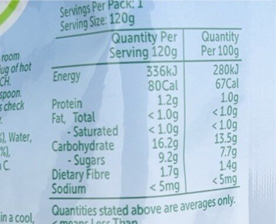

```{r setup, include=FALSE}
if (!require("pacman")) install.packages("pacman", repos = "http://cran.us.r-project.org")
pacman::p_load(tidyverse, cowplot, gganimate, palmerpenguins, patchwork, openintro, ggdist)
pacman::p_load_gh("datalorax/equatiomatic")
# set ggplot2 theme
ggplot2::theme_set(cowplot::theme_half_open())
```

## Learning objectives

By the end of this lecture, you should be able to:

- [ ] identify whether a study involves a reference value, independent groups, or paired measurements;
- [ ] decide which comparison of means is appropriate for the study design;
- [ ] use a linear model, where useful, to describe that comparison; and
- [ ] assess and interpret the result.

# When is a difference in means meaningful?

##

{fig-alt=""}

::: fragment
> Do male and female Gentoo penguins differ in body mass?
:::

##

:::: {.columns}
:::: {.column width="50%"}


](assets/dodgy-food.png){fig-align="left"}
::::
:::: {.column width="50%"}
{width="100%" fig-alt="Nutrition-information panel for Smiling Tums Apple and Banana with Oats. It lists sugars as 7.7 grams per 100 grams."}
::::
:::::


>  Is the sugar content (7.7 g per 100 g) of this particular baby food product different from that advertised?


## [TL;DR](https://en.wikipedia.org/wiki/TL;DR)

- Often, we see patterns that clearly show differences from expectations, or between groups. 
- The ***t*-test** allows us to quantify these differences and determine if they are **statistically significant**.

. . . 

We may compare:

- a sample mean with a reference value;
- mean values from two independent groups; or
- mean values from paired measurements.

. . .

In each case, we ask whether the observed **differences** are simply because sample vary.

. . .

**But really, these are general linear models (GLMs) but with either no predictor or binary predictors.** The slope and intercept are simply derived from "two" values.


## History and context
::: columns
::: {.column width="40%"}
 (1876-1937)](assets/will.png){fig-align="left"}
:::
::: {.column width="60%"}

> Fisher would have discovered it anyway...

-- *on his invention of the t-statistic and the t-distribution*

::: fragment
- A statistician at Guinness Brewery.
- Developed the *t*-test to monitor the quality of stout (beer), **by comparing barley yields**.
:::
:::
:::


# The *t*-distribution


## Normal distribution and the *t*-distribution

:::: {.columns}
::: {.column width="32%"}

Both distributions are centred on zero.

The *t*-distribution is:

- lower in the middle; and
- heavier in the tails.

:::
::: {.column width="68%"}

```{r}
data(IMSCOL)

df <- tibble(
    x = seq(-5, 5, 0.01),
    normal = dnorm(x),
    t = dt(x, df = 4)
)

ggplot(df, aes(x = x)) +
    geom_line(
        aes(y = normal),
        color = IMSCOL["blue", "full"],
        linetype = "dashed",
        linewidth = 0.5
    ) +
    geom_line(
        aes(y = t),
        color = IMSCOL["red", "full"],
        linetype = "solid",
        linewidth = 1
    ) +
    annotate(
        "text",
        x = 0, y = 0.40, vjust = -0.5,
        label = "Normal distribution",
        color = IMSCOL["blue", "full"],
        size = 5
    ) +
    annotate(
        "text",
        x = 3, y = 0.03, vjust = -0.5,
        label = "t-distribution",
        color = IMSCOL["red", "full"],
        size = 5
    ) +
    labs(x = "Standardised value", y = "Density") +
    theme_cowplot(font_size = 18)
```

:::
::::


## As sample size increases, the *t*-distribution approaches normality

::::: {.columns}
:::: {.column width="32%"}

Smaller samples produce heavier tails because there is more uncertainty when variation is estimated from the data.

::::
:::: {.column width="68%"}

```{r}
data(IMSCOL)

df <- tibble(
    x = seq(-5, 5, 0.01),
    normal = dnorm(x),
    t_small = dt(x, df = 2),
    t_large = dt(x, df = 8)
)

ggplot(df, aes(x = x)) +
    geom_line(
        aes(y = normal),
        color = IMSCOL["blue", "full"],
        linetype = "dashed",
        linewidth = 0.5
    ) +
    geom_line(
        aes(y = t_large),
        color = "darkorchid",
        linetype = "solid",
        linewidth = 1
    ) +
    geom_line(
        aes(y = t_small),
        color = IMSCOL["red", "full"],
        linetype = "dotdash",
        linewidth = 1
    ) +
    annotate(
        "text",
        x = 0, y = 0.40, vjust = -0.5,
        label = "Normal distribution",
        color = IMSCOL["blue", "full"],
        size = 5
    ) +
    annotate(
        "text",
        x = 3, y = 0.02, vjust = -0.5,
        label = "Larger sample",
        color = "darkorchid",
        size = 5
    ) +
    annotate(
        "text",
        x = 3, y = 0.06, vjust = -0.5,
        label = "Smaller sample",
        color = IMSCOL["red", "full"],
        size = 5
    ) +
    labs(x = "Standardised value", y = "Density") +
    theme_cowplot(font_size = 18)
```

::::
:::::

## The *t*-statistic compares a difference with its uncertainty

$$
t = \frac{\text{Signal}}{\text{Noise}}
$$

- **Signal:** the observed difference of interest, such as a difference between group means.
- **Noise:** the uncertainty around that difference.

A large absolute value of *t* means that the observed difference is large relative to the uncertainty in the estimate.

## In practice...

It is more simple than that. Simply identify the two groups of interest and most modern software will do the rest.

::: columns
::: {.column width="50%"}
### One-sample *t*-test


Are penguin bill lengths different from 40 mm?


```{r}
#| echo: true
#| code-fold: true
data(penguins)
t.test(penguins$bill_length_mm, mu = 40)
```
:::
::: {.column width="50%"}
### Two-sample *t*-test

Is bill length different between Male and Female penguins?

```{r}
#| echo: true
#| code-fold: true
t.test(bill_length_mm ~ sex, var.equal = TRUE, data = penguins)
```
:::
:::


# Modelling the *t*-test

## Model-centric approach

The *t*-test is a special case of the GLM because it can be considered a linear model, but the predictors are **binary** (two categories in a two-sample *t*-test), or **absent** (one-sample *t*-test or paired *t*-test) rather than continuous. 

 So, given that $$ \text{response} \sim \text{predictor} $$ then for the **two-sample *t*-test**, the model is $$ \text{response} = \beta_0 + \beta_1 \cdot \text{predictor} + \epsilon $$

and for a **one-sample or paired *t*-test**, the model is $$ \text{response} = \beta_0 + \epsilon $$ 

::: fragment
Essentially, we need to understand that $\beta_1$ is the difference between the two groups, and $\beta_0$ is the mean of the first group.
:::


# One-sample *t*-test

## The question

Are mean penguin bill lengths in my sample (blue line) different from 40 mm (red line)?

### One-sample *t*-test

```{r}
penguins |>
    ggplot(aes(x = bill_length_mm, y = "")) +
    geom_boxplot(width = .2) +
    geom_vline(xintercept = 40, color = "red", linetype = "dashed") +
    geom_vline(xintercept = mean(penguins$bill_length_mm, na.rm = TRUE), color = "blue", linetype = "dashed") +
    theme_cowplot()

```

## Modelling the one-sample *t*-test

- **Response**: bill length
- **Predictor**: none, instead we test whether the response is equal to a known value (intercept).

### The model
Bill length is defined by a mean of 40 mm: $$ \text{bill length} \sim 40 $$


## Modelling the one-sample *t*-test

We generally need to subtract the known value from the response variable such that:

$$ \text{bill\_length\_mm} - 40 \sim 0 $$


### In R

```{r}
fit <- lm(bill_length_mm - 40 ~ 1, data = penguins)
summary(fit)
```

## Modelling the one-sample *t*-test

We generally need to subtract the known value from the response variable such that:

$$ \text{bill\_length\_mm} - 40 \sim 0 $$


### In Jamovi

You will need to double-click on the variable name and transform it to `$source-40`, then use the new variable in the analysis.


:::: fragment
The one-sample *t*-test is also one of the few cases where it is probably easier to use the traditional approach. So think of this exercise as a way to understand the GLM approach (and proof that it applies).
::::

## Assumptions of the one-sample *t*-test

For the one-sample *t*-test, the only assumption is that the residuals are normally distributed. Under the GLM framework, we can check this by looking at the QQ-plot of the residuals.

```{r}
plot(fit, which = 2)
```

The residuals show that the data does not meet the assumption of normality, but the model is robust to this violation as long as the sample size is large and the samples are representative of the population.

## Assumptions of the one-sample *t*-test

We can also just plot the raw data in the traditional way to check for normality, since there is only one group of data to plot.

```{r}
penguins |>
  ggplot(aes(sample = bill_length_mm)) +
  stat_qq() +
  stat_qq_line() +
  labs(x = "Theoretical quantiles", y = "Sample quantiles") +
  theme_cowplot()
```

The patterns are identical since there are no predictors in the model.

## Interpretation

::: columns
::: {.column width="40%"}
```{r}
t.test(penguins$bill_length_mm, mu = 40)
```

:::
::: {.column width="60%"}
```{r}
summary(fit)
```
:::

:::

Notice the similarities and differences between the two approaches.

## Reporting

::: fragment
### Methods
A **one-sample t-test** was conducted to determine whether the mean bill length of penguins significantly differed from a hypothesised mean of 40 mm. The analysis was conducted using R version 4.4.0 (R Core Team, 2024) with the `t.test()` function. The assumption of normality was checked visually by examining the QQ-plot of the raw data. This assumption was not met, but the *t*-test was considered robust due to the large sample size and representativeness of the data and was therefore reported.


### Results
The analysis revealed a statistically significant difference, with the mean bill length (43.9 mm) being significantly greater than 40 mm (t = 13.29 , df = 341, p < 0.01). The 95% confidence interval for the mean bill length was [43.34, 44.50] mm.
:::

## Reporting

### Methods
A **general linear model (GLM)** ~~equivalent to a one-sample t-test~~ was performed to determine whether the mean bill length of penguins differed from a hypothesised value of 40 mm. The analysis was conducted using R version 4.4.0 (R Core Team, 2024), with the model specified as:  $$\text{bill\_length\_mm} - 40 \sim 1$$ where the intercept represents the difference between the mean bill length and 40 mm. The assumption of normality was checked visually by examining the QQ-plot of the residuals. This assumption was not met, but the model was considered robust due to the large sample size and representativeness of the data.


### Results
The results indicated that the mean difference in bill length from 40 mm was statistically significant. The mean bill length was estimated to be 3.92 mm greater than 40 mm, with a standard error of 0.30 mm (GLM, t = 13.29, df = 341,  p < 0.001). 


# Two-sample *t*-test

## The question

Are the mean bill lengths between male and female penguins different? ***If they are not, then both groups should have the same mean (dotted line).***


```{r}
## comparative boxplots with the mean of both groups as horizontal line

penguins |>
  drop_na(sex) |>
  ggplot(aes(x = sex, y = bill_length_mm)) +
  geom_boxplot() +
  geom_hline(yintercept = mean(penguins$bill_length_mm, na.rm = TRUE), linetype = "dashed") +
  theme_cowplot()
```

## Modelling the two-sample *t*-test

- **Response**: bill length
- **Predictor**: sex

### The model

Bill length is a function of sex:

$$ \text{bill length} \sim \text{sex} $$

## Modelling the two-sample *t*-test

The model specification is more straightforward since a predictor is present: 
$$ \text{bill\_length\_mm} \sim \text{sex} $$

```{r}
fit2 <- lm(bill_length_mm ~ sex, data = penguins) 
summary(fit2)
```

## Assumptions of the two-sample *t*-test: LINE

### If we were to use the traditional *t*-test approach

- Divide the data into the two groups: male and female
- Check the normality and equal variances of the residuals for each group

```{r}
penguins |>
  drop_na(sex) |>
  ggplot(aes(x = sex, y = bill_length_mm)) +
  geom_boxplot() +
  theme_cowplot()

```

## Assumptions of the two-sample *t*-test: LINE

### If we were to use the traditional *t*-test approach

- Divide the data into the two groups: male and female
- Check the normality and equal variances of the residuals for each group

```{r}
penguins |>
  drop_na(sex) |>
  ggplot(aes(sample = bill_length_mm)) +
  stat_qq() +
  stat_qq_line() +
  facet_wrap(~sex) +
  theme_cowplot()
```

## Assumptions of the two-sample *t*-test: LINE

### GLM approach

View the residuals of the model; no need to divide the data

::: fragment

```{r}
par(mfrow = c(2, 2))
plot(fit2)
```
:::

## Interpretation

::: columns
::: {.column width="40%"}
```{r}
t.test(bill_length_mm ~ sex, var.equal = TRUE, data = penguins)
```
:::
::: {.column width="60%"}
```{r}
summary(fit2)
```
:::
:::

Suggestion: paste the results into ChatGPT and ask for a summary.

## What if the assumptions are violated?

1. **Normality**: the *t*-test is robust to violations of normality, especially with large sample sizes. However we can consider transforming the data or using a non-parametric test such as the Wilcoxon rank-sum test if the data is highly skewed.
2. **Equal variances**: transforming the data can help, but we can consider Welch's *t*-test, which does not assume equal variances, as a viable alternative. Note: there is a [GLM approach](https://stats.stackexchange.com/questions/142685/equivalent-to-welchs-t-test-in-gls-framework) to this but it is complex, so we will not cover it here.

# Paired *t*-test

## First, about related (or paired) samples

- **Related samples** are those where the measurements are taken from the same individual or object at different times or under different conditions: 
  - before and after treatment, 
  - left and right eyes, 
  - two different methods of measurement of the same subject, etc.
- This causes the measurements to be **dependent** on each other.
- There is correlation or covariance between the measurements, therefore we use the difference between the measurements as the response variable rather than the measurements separately.

This is one of the few cases where the **independence** assumption matters and can result in using a paired *t*-test instead of a two-sample *t*-test.

## The question

Is sleep duration different before and after treatment? [Student's sleep data](https://stat.ethz.ch/R-manual/R-devel/library/datasets/html/sleep.html), where the same 10 patients were observed for two weeks, with the first week being a control week and the second week being a treatment week.

### Modelling the question

- **Response**: sleep duration
- **Predictor**: week

### The model

Sleep duration is a function of the week:

$$ \text{sleep duration} \sim \text{week} $$

## Modelling the paired *t*-test

We need to subtract the sleep duration in the control week from the sleep duration in the treatment week such that: $$ \text{sleep duration (treatment)} - \text{sleep duration (control)} \sim 0 $$

```{r}
data(sleep)
control <- sleep$extra[sleep$group == 1]
treatment <- sleep$extra[sleep$group == 2]
fit3 <- lm(treatment - control ~ 1)
summary(fit3)

```

## Assumptions of the paired *t*-test

Because the data is paired, variances should be equal and do not need to be checked, although unequal variances highlight possible issues with the data. 

**Otherwise, only the normality assumption needs to be checked.**

We will not check the assumptions here, since the process remains the same.


## Further thinking

- The GLM approach means that the model *just so happens* to match a *particular* traditional test.
- Interpretation of the model can change as soon as the **structure** of any of the variables change.

::: fragment
### Example: *t*-test vs. ANOVA

The two-sample *t*-test can be extended to a **one-way ANOVA** if we have more than two groups to compare. The model remains the same, but the interpretation changes! $$ \text{response} = \beta_0 + \beta_1 \cdot \text{predictor} + \epsilon $$

We will cover this in great detail next week.
:::

## Questions to consider

- What are the assumptions of the one-sample *t*-test, two-sample *t*-test, and paired *t*-test? Are they the same?
- How do you interpret the results of a GLM compared to a traditional *t*-test?
- What are the advantages and disadvantages of using the GLM approach over the traditional approach?

# Thanks

This presentation is based on the [SOLES Quarto reveal.js template](https://github.com/usyd-soles-edu/soles-revealjs) and is licensed under a [Creative Commons Attribution 4.0 International License][cc-by].


<!-- Links -->
[cc-by]: http://creativecommons.org/licenses/by/4.0/
