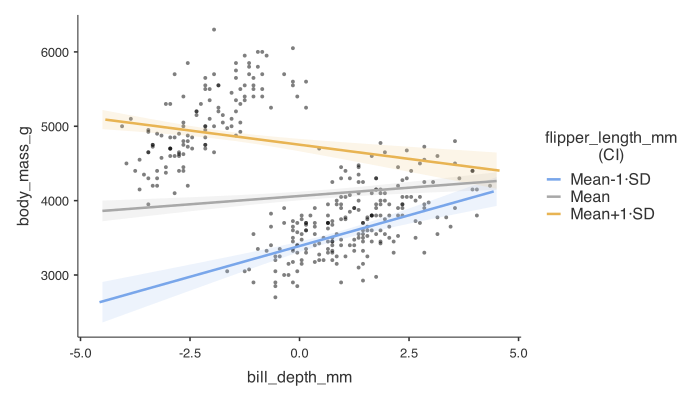

```{r setup}
#| include: false

library(tidyverse)
library(palmerpenguins)
library(cowplot)
library(patchwork)
library(gtsummary)
library(broom.helpers)
library(cardx)
library(see)
library(performance)
library(sjPlot)
library(plotly)

data(penguins)

```

## Learning objectives

You should be able to:

- [ ] Include multiple predictors in a linear model.
- [ ] Interpret and report multiple linear regression coefficients.
- [ ] Assess model assumptions.
- [ ] Identify and check for multicollinearity.
- [ ] Decide when to include interaction terms, and interpret and visualise them.


## Before we begin...


> 生活其实很简单，但我们总是把它复杂化


::::: fragment
> “Life is really simple, but we insist on making it complicated.”
>
> [Confucius](https://en.wikipedia.org/wiki/Confucius)
:::::

## Predicting penguin body mass

{fig-alt="Photograph of an Adélie penguin with one flipper extended." width="75%"}

What relationship would you expect between flipper length and body mass?

**What other factors might influence body mass?**

## Expanding a model {auto-animate=true}

:::: fragment
We start with the *simple* model:

$$ \text{body mass} \sim \text{flipper length}$$ 

::::

:::: fragment
But, we know that there are other (possible) factors that may influence the body mass of a penguin.

$$ Sex $$ $$ Species $$ $$ Bill\ length $$

::::

:::: fragment
### It is rarely the case that a response variable is influenced by a *single* explanatory variable.

Importantly, we include additional variables in the model only if they are necessary in answering biological questions -- there is *no point* in a highly precise model if it cannot be interpreted in a biologically meaningful way. 
::::


## How do we include multiple predictors in a model? {auto-animate=true}

$$ \text{body mass} \sim \text{flipper length}$$ 

:::: fragment
$$ y \sim x $$
::::

:::: fragment

We add more predictors to the model by including them in the equation:

$$ y \sim x_1 + x_2 + x_3 + \ldots + x_n $$ 

where $x_1, x_2, x_3, \ldots, x_n$ are the predictors **that can be continuous or categorical**, or both.
::::

:::: fragment

### Examples

- $\text{body mass} \sim \color{blue}\text{flipper length} \color{black} + \color{blue}\text{bill depth}$, all continuous
- $\text{body mass} \sim \color{blue}\text{flipper length} \color{black} + \color{orange}\text{species}$, at *least* one continuous, one categorical
- $\text{body mass} \sim \color{orange}\text{sex} \color{black} + \color{orange}\text{species}$, all categorical

::::

## Simple is best {auto-animate=true}

- $\text{body mass} \sim \color{blue}\text{flipper length} \color{black} + \color{blue}\text{bill depth}$, all continuous
- $\text{body mass} \sim \color{blue}\text{flipper length} \color{black} + \color{orange}\text{species}$, at *least* one continuous, one categorical
- $\text{body mass} \sim \color{orange}\text{sex} \color{black} + \color{orange}\text{species}$, all categorical

::: fragment
The simplest model is one that is **ADDITIVE**, where in theory, each predictor contributes to the response variable *independently* of the other predictors.
:::

:::: fragment
Once the model is built, the makeup of the model determines whether it is equivalent to a $t$-test, ANOVA, or ANCOVA, linear regression or multiple linear regression...
::::

## Focusing on continuous predictors (for now)

In this lecture, we will focus on this:

$$\text{body mass} \sim \color{blue}\text{flipper length} \color{black} + \color{blue}\text{bill depth}$$

where all predictors are *continuous* variables.

### Study design

- **Response variable**: body mass (g)
- **Predictors**: flipper length (mm) and bill depth (mm)


# Why do we need multiple variables?

## A quick warning (again)

> The combination of some data and an aching desire for an answer does not ensure that a reasonable answer can be extracted from a given body of data.

— [John Tukey](https://en.wikipedia.org/wiki/John_Tukey) (1915-2000), *The Future of Data Analysis* (1962)


## Prediction vs interpretation

- Multiple predictors can improve **predictive accuracy**.
- The focus shifts from explaining individual effects to predicting new observations.
- A useful prediction model performs well on **new data**, not only on the data used to fit it.
- This is not the focus of BEDA, but it is important in fields such as machine learning.

For explanatory biological models, prefer the simplest model that answers the research question. Add variables only when they are justified as controls, interactions, or predictors of biological interest.

## Interpreting multiple-predictor models

- **Conditional coefficients**: each effect is interpreted while holding the other predictors fixed.
- **Interactions**: one predictor's effect may change with another predictor's value.
- **Correlated predictors**: strong correlations make individual effects harder to estimate.
- **Model checking**: continue to assess the model assumptions.

# Worked example: Palmer penguins

## A modelling workflow

### Can flipper length predict penguin body mass?

Our workflow is more or less fixed:

$$ \text{body mass} \sim \color{blue}\text{flipper length} $$

1. Visualise the relationship.
2. Fit the regression model.
3. Check and revise the model if needed (assumptions, outliers, issues).
4. Interpret the model.

## 1 of 4: Visualise the relationship


```{r}
#| label: fig-penguin0
#| fig-cap: "Scatterplot of flipper length and body mass of penguins. The blue line represents the fitted linear regression model."
data(penguins)

penguins |>
  ggplot(aes(x = flipper_length_mm, y = body_mass_g)) +
  geom_point() +
  geom_smooth(method = "lm", se = FALSE) +
  xlab("Flipper length (mm)") +
  ylab("Body mass (g)") +
  theme_cowplot()

```


## 2 of 4: Fit the model

Why is it necessary to fit the model first?

- DO **NOT** interpret the significance of any effect/predictor until we have checked assumptions
- DO have a look at the model summary to determine precision of the estimates and the overall model fit (e.g. R^2^, adjusted R^2^)
- DO check that you have fit the model correctly (e.g. correct predictors, correct data, correct formula, etc.)

## 3 of 4: Check assumptions


```{r}
#| fig-height: 9
#| fig-width: 9
#| label: fig-penguin1
#| fig-cap: "Diagnostic plots for the linear regression model predicting body mass from flipper length."
fit <- lm(body_mass_g ~ flipper_length_mm, data = penguins)
par(mfrow = c(2, 2))
plot(fit)
```


## 4: Interpret

```{r}
summary(fit)
```

(We are skipping this, just want to show raw output)

## 4: Interpret

$$ \text{body mass} \sim \color{blue}\text{flipper length} $$

```{r}
#| label: tbl-penguin1
#| echo: false
#| tbl-cap: "Linear regression of body mass (g) on flipper length (mm) in palmer penguins."

tab_model(
  fit,
  show.intercept = FALSE,
  pred.labels = "Flipper length (mm)",
  dv.labels = "Body mass (g)"
)
```


:::: fragment

> The results of the multiple linear regression analysis indicate that the flipper length is a highly significant predictor of the body mass of penguins (p < 0.001, @tbl-penguin1). The model demonstrates a strong relationship between the two variables, explaining 75% of the variance in the body mass (R^2^ = 0.76). Specifically, the analysis reveals that for every 1 mm increase in flipper length, the body mass of a penguin increases by 50 g.

::::


# Adding more predictor(s)
What if we add another variable to the model, such as bill depth? 

## A *multiple* linear regression model 
$$ \text{body mass} \sim \color{blue}\text{flipper length} \color{black} + \color{blue}\text{bill depth}$$

### Four steps (it does not change... much):

1. Visualise the relationship.
2. Fit the regression model.
3. Check and revise the model if needed (assumptions, outliers, issues) - **multicollinearity**.
4. Interpret the model.


## Multicollinearity

- **Multicollinearity** means the predictors in the model are correlated with each other.
  - It inflates the standard errors of the coefficients, making estimates less precise.
  - It makes coefficient interpretation harder because one predictor's effect is partly mixed with the other.
- **What to do**:
  - Check the correlation between predictors. If the correlation is very high (rule of thumb: $r > 0.7$), consider removing one predictor.
  - You can also check the variance inflation factor (VIF): VIF > 5 is high, and VIF > 10 is very high.


## 1 of 4: Visualise the relationship

$$ \text{body mass} \sim \color{blue}\text{flipper length} \color{black} + \color{blue}\text{bill depth}$$

```{r}
plot_ly(penguins,
  x = ~flipper_length_mm,
  y = ~body_mass_g,
  z = ~bill_depth_mm,
  type = "scatter3d",
  mode = "markers",
  size = I(16),
  height = 500
)

```

Visualising MLR is challenging. Perhaps the maximum number of predictors we can visualise is 2 against the response variable. In most cases we rely on the diagnostic plots to interpret the model.

## 1 of 4: Visualise the relationship

Because we assume the effects are **additive** it is possible to visualise the relationship between the response variable and each predictor while holding the other predictor constant.

```{r}

p1 <- ggplot(penguins, aes(x = flipper_length_mm, y = body_mass_g)) +
  geom_point() +
  geom_smooth(method = "lm", se = FALSE) +
  xlab("Flipper length (mm)") +
  ylab("Body mass (g)") +
  theme_cowplot()

p2 <- ggplot(penguins, aes(x = bill_depth_mm, y = body_mass_g)) +
  geom_point() +
  geom_smooth(method = "lm", se = FALSE) +
  xlab("Bill depth (mm)") +
  ylab("Body mass (g)") +
  theme_cowplot()

(p1 | p2)
```

## 2 of 4: Fit the model

Why is it necessary to fit the model first?

## 3 of 4: Check assumptions

$$ \text{body mass} \sim \color{blue}\text{flipper length} \color{black} + \color{blue}\text{bill depth}$$

```{r}
#| fig-height: 9
#| fig-width: 9
#| label: fig-penguin2
#| fig-cap: "Diagnostic plots for the multiple linear regression model predicting body mass from flipper length and bill depth."
fit <-
  penguins |>
  lm(body_mass_g ~ flipper_length_mm + bill_depth_mm, data = _)
par(mfrow = c(2, 2))
plot(fit)
```

## 3 of 4: Check multicollinearity

Correlation between predictors:
```{r}
#| echo: true
penguins |>
  select(flipper_length_mm, bill_depth_mm) |>
  drop_na() |>
  cor()
```
  
Or, check VIF (variance inflation factor):

```{r}
#| echo: true
performance::check_collinearity(fit)

```

## 4: Interpret

$$ \text{body mass} \sim \color{blue}\text{flipper length} \color{black} + \color{blue}\text{bill depth}$$

```{r}
#| echo: false
sjPlot::tab_model(
  fit,
  show.intercept = FALSE,
  pred.labels = c("Flipper length (mm)", "Bill depth (mm)"),
  dv.labels = "Body mass (g)"
)
```

## 4: Interpret partial effect: flipper length

$$ \text{body mass} \sim \color{blue}\text{flipper length} \color{black} + \color{blue}\text{bill depth}$$

```{r}
#| echo: false
sjPlot::tab_model(
  fit,
  terms = "flipper_length_mm",
  show.intercept = FALSE,
  show.r2 = FALSE,
  show.obs = FALSE,
  show.fstat = FALSE,
  pred.labels = "Flipper length (mm)",
  dv.labels = "Body mass (g)"
)
```

- Flipper length is a significant predictor of body mass (p < 0.001), with a positive relationship where, for every 1 mm increase in flipper length, the body mass of a penguin increases by 52 g, *holding bill depth constant*.

## 4: Interpret partial effect: bill depth

$$ \text{body mass} \sim \color{blue}\text{flipper length} \color{black} + \color{blue}\text{bill depth}$$

```{r}
#| echo: false
sjPlot::tab_model(
  fit,
  terms = "bill_depth_mm",
  show.intercept = FALSE,
  show.r2 = FALSE,
  show.obs = FALSE,
  show.fstat = FALSE,
  pred.labels = "Bill depth (mm)",
  dv.labels = "Body mass (g)"
)
```

- Holding flipper length constant, the estimated association is about +23 g in body mass per 1 mm increase in bill depth, but the 95% confidence interval (-3.49 to 48.76) includes zero and the effect is not statistically significant (p = 0.089).

## 4: How well does the model fit?

$$ \text{body mass} \sim \color{blue}\text{flipper length} \color{black} + \color{blue}\text{bill depth}$$

```{r}
#| echo: false
sjPlot::tab_model(
  fit,
  show.intercept = FALSE,
  pred.labels = c("Flipper length (mm)", "Bill depth (mm)"),
  dv.labels = "Body mass (g)"
)
```
- Both predictors explain 76% of the variance in body mass (adjusted R^2^ = 0.76).

# Interactions
Will the relationship between A and B change, if C changes?


## When to include interactions?

For any predictor that is included in the model and is not used as a control, we should consider interactions with other predictors.

### Why interactions?

Interactions allow us to assess how one predictor influences the relationship between the response variable and another predictor. Examples:

- Does sunlight exposure affect plant growth? It **depends** on water availability, i.e. sunlight exposure and water availability may interact such that the effect of sunlight exposure is different depending on the level of water availability.
- Does the effect of a drug on blood pressure depend on the age of the patient? It **depends** on the age of the patient, i.e. the effect of the drug on blood pressure may be different depending on the age of the patient.

## Recall the plot of flipper length and bill depth 

```{r}
penguins |>
  select(flipper_length_mm, bill_depth_mm) |>
  plot()
```

Do you think the two predictors are interacting?

## Including interactions in the model {auto-animate=true}

For a given MLR model $$ y \sim x_1 + x_2 $$ we can declare an interaction term between $x_1$ and $x_2$ by changing the operator from $+$ to $\times$ or $*$: $$ y \sim x_1 \times x_2 $$

:::: fragment
So for the current MLR model from the penguins dataset:

$$ \text{body mass} \sim \color{blue}\text{flipper length} \color{black} + \color{blue}\text{bill depth}$$

becomes:

$$ \text{body mass} \sim \color{blue}\text{flipper length} \color{black} \times \color{blue}\text{bill depth}$$

which is also equivalent to:
$$ \text{body mass} \sim \color{blue}\text{flipper length} \color{black} + \color{blue}\text{bill depth} \color{black} + \color{red}\text{flipper length:bill depth}$$
::::


## Checking the model {auto-animate=true}

$$ \text{body mass} \sim \color{blue}\text{flipper length} \color{black} \times \color{blue}\text{bill depth}$$


### Four steps (it does not change!):

1. Visualise the relationship.
2. Fit the regression model.
3. Check and revise the model if needed (assumptions, outliers, issues) - **multicollinearity**.
4. Interpret the model - **but be careful!**

## 2. Diagnostic plots (assumptions)

$$ \text{body mass} \sim \color{blue}\text{flipper length} \color{black} \times \color{blue}\text{bill depth}$$

```{r}
fit <- lm(body_mass_g ~ flipper_length_mm * bill_depth_mm, data = penguins)
par(mfrow = c(1, 4))
plot(fit)
```

## 4. Interpret 

```{r}
summary(fit)
```

- If the interaction term is significant, it means that the interpretation of the main effects are most likely incorrect. We no longer interpret the main effects. **Instead, we figure out *how* those main effects are interacting.**


## Interaction plots 

To view the interaction, we need to work out at what "level" of a variable the relationship between the response variable and the other predictor is significant. 

This can be automated in both R and Jamovi.

```{r}
library(emmeans)
p_emm <- emmip(fit, flipper_length_mm ~ bill_depth_mm, cov.reduce = range) +
  theme_cowplot()
p_emm
```

## Interaction plot in Jamovi




## Interpreting the plot 

> Does bill depth affect the predicted outcome? It depends on flipper length!

Results indicate a significant interaction between flipper length and bill depth (p < 0.001). The interaction plot shows that the relationship between flipper length and body mass is dependent on bill depth. Specifically:

- For smaller flipper lengths (e.g. 172 mm), increasing bill depth is associated with an increase in body mass.
- For larger flipper lengths (e.g. 231 mm), increasing bill depth is associated with a decrease in body mass.

Note, R provides some information about what is "small" or "large" in the interaction plot, whereas Jamovi does not.


## What is actually happening?

```{r}
penguins |>
  select(flipper_length_mm, bill_depth_mm) |>
  plot()
```

It is likely that something else is confounding the relationship between flipper length and body mass, as we have observed clustering in the plot of flipper length and bill depth.


## Questions to consider

- What does it mean for a model to be additive?
- How do we interpret the coefficients of a multiple linear regression model?
- What are the assumptions of a multiple linear regression model? 
- How do we check for multicollinearity in a multiple linear regression model?
- What is an interaction term in a multiple linear regression model, and how can we interpret it if it is significant?

# Thanks!

This presentation is based on the [SOLES Quarto reveal.js template](https://github.com/usyd-soles-edu/soles-revealjs) and is licensed under a [Creative Commons Attribution 4.0 International License][cc-by].


<!-- Links -->
[cc-by]: http://creativecommons.org/licenses/by/4.0/
