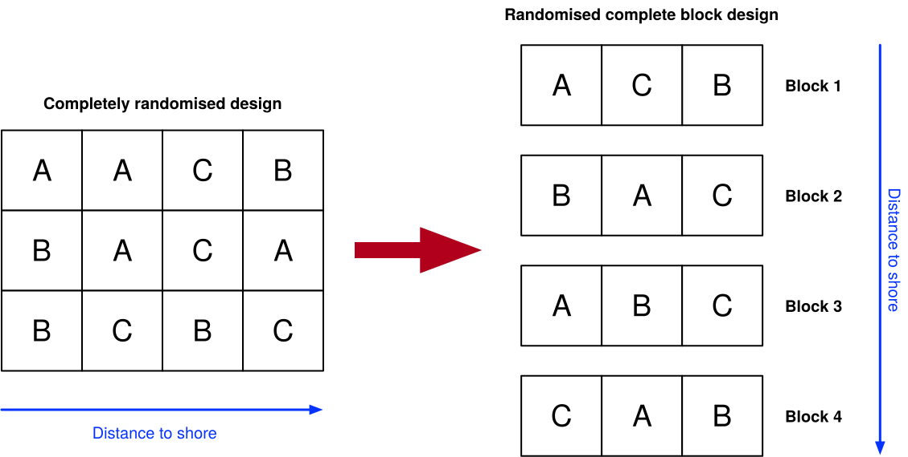
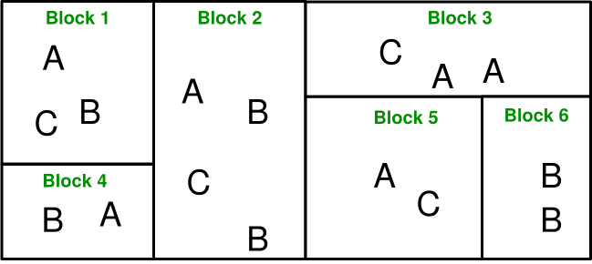
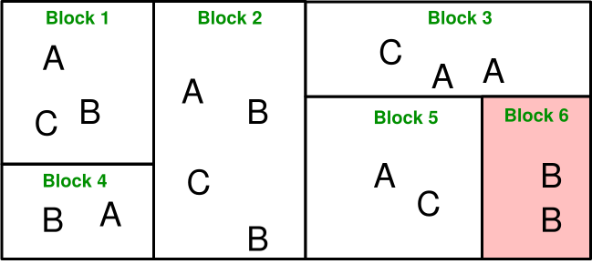
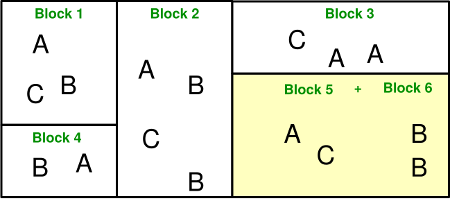

```{r setup}
#| include: false

library(tidyverse)
library(palmerpenguins)
library(gtsummary)
library(gt)
library(rstatix)
library(emmeans)
library(patchwork)
data(penguins)
```

# Recall


## The general linear model {auto-animate=true}

So far we have been discussing the general linear model (GLM) in terms of coming up with a **relationship** between a **response variable** and one or more **predictors/explanatory variables**.

$$ y \sim x_1 + x_2 + \ldots + x_n $$ 


To simplify today's lecture, we will focus on a simpler model with two predictors (and ***no*** interaction): 

$$ y \sim x_1 + x_2 $$


## What model am I fitting? {auto-animate=true}

$$ y \sim x_1 + x_2 $$

::: fragment
### When both predictors are [CONTINUOUS]{style="color:blue"}

$$
\text{body mass} \sim \textcolor{blue}{\text{bill length}} + \textcolor{blue}{\text{flipper length}}
$$

Use a **regression summary** and interpret beta ($\beta$) coefficients:

```{r}
#| cache: true

fit01 <- lm(body_mass_g ~ bill_length_mm  + flipper_length_mm, data = penguins)
summary(fit01) |>
    gtsummary::tbl_regression()
```

:::

## What model am I fitting?

$$ y \sim x_1 + x_2 $$

### When both predictors are [CATEGORICAL]{style="color:orange"}

::: fragment

$$ \text{body mass} \sim \textcolor{orange}{\text{species}} \textcolor{black}{+} \textcolor{orange}{\text{sex}} $$

Use an **ANOVA summary** and *also* interpret the **post-hoc tests** to figure out where the differences are:

::: columns
::: {.column width="40%"}

#### ANOVA
```{r}
#| cache: true

fit02 <- lm(body_mass_g ~ species + sex, data = penguins)
car::Anova(fit02) |>
    anova_summary() |>
    select(-ges) |>
    gt()

```
:::
::: {.column width="60%"}
#### Estimated marginal means
```{r}
#| cache: true
#| fig-height: 4

p1 <- emmeans(fit02, pairwise ~ species) |>
  plot() +
  cowplot::theme_cowplot()
p2 <- emmeans(fit02, pairwise ~ sex) |>
  plot() +
  cowplot::theme_cowplot()

p1 / p2
```
:::
:::
:::


## What model am I fitting?

$$ y \sim x_1 + x_2 $$

### When both predictors are [CONTINUOUS]{style="color:blue"} and [CATEGORICAL]{style="color:orange"}

::: fragment

$$ \text{body mass} \sim \textcolor{blue}{\text{bill length}} \textcolor{black}{+} \textcolor{orange}{\text{species}} $$

::: columns
::: {.column width="50%"}
#### Regression
```{r}
fit03 <- lm(body_mass_g ~  bill_length_mm + species, data = penguins)
summary(fit03) |>
    gtsummary::tbl_regression()
```
:::
::: {.column width="50%"}

#### ANOVA
```{r}
#| fig-height: 2.5
car::Anova(fit03) |>
    anova_summary() |>
    select(-ges) |>
    gt()

emmeans(fit03, pairwise ~ species) |>
  plot() +
  cowplot::theme_cowplot()
```
:::
:::
:::


# Modelling + study design

## Updating a model

> Block what you can; randomise what you cannot.

-- George Box (1978), on the design of experiments. [Source](https://williamghunter.net/george-box-articles/must-we-randomize-our-experiment)


## The ideal study rarely happens

In the real world, designing a study is *not as simple as fitting a model on just the variables of interest*. 

Sometimes...

::: incremental
- Our study is *large and complex* (e.g. spans multiple **locations**, **times**, etc.), so keeping things consistent between them is *almost* impossible.
- We encounter **location-specific** effects that are probably difficult to measure as *specific* variables e.g. farm, lab, greenhouse.
- Other variables can be measured, but are random and not balanced e.g. humidity, sex of the animal sampled, etc.
:::

::: fragment
**The ideal study** is one where we can isolate these issues in the statistical model so that their effects are "partitioned away" from the variables of interest as *noise*.
:::


## The concept of "control" in a model

It turns out that we *can* **plan our data collection** in a way that if certain variables are not of interest but are likely to affect our response variable, we can include their effects in our model as **control variables**.

::: fragment
These variables have special names (but in the end they are just predictors in the model):

- **COVARIATE**: variables that are likely to affect the response variable, yet we **cannot control** them. i.e. they are **measured**, not assigned. Most likely **continuous**, but can be **categorical**.
- **BLOCK**: nuisance factors that are likely to affect the response variable, and that we account for by **allocating (replicating) treatments within each of their levels**. Most likely **categorical**.

:::

::: fragment
We include the control variable as a *predictor*, **but we are not interested in its effect on the response variable**.
:::


# Covariates

Measured before, during or after the experiment, and not manipulated.

## Example: lake species diversity

We want to measure the effect of aquaculture exposure on species diversity in lakes, but the size of the lake can also affect the diversity of species (e.g. larger lakes can support more species).

.](assets/3lakes.jpg){fig-align="center"}

::: {.fragment}

$$ \text{species diversity} \sim \textcolor{red}{\text{lake size}} + \textcolor{black}{\text{aquaculture exposure}} $$

What is the effect of aquaculture exposure on species diversity, *if we control for the effects of lake size*?

:::

## Example: penguin body mass {auto-animate=true}

We want to determine differences in the body mass of penguins based on their species, but we know that the sex of the penguin matters (e.g. males are generally heavier). 

{fig-align="center"}


$$ \text{body mass} \sim \textcolor{red}{\text{sex}} + \textcolor{black}{\text{species}} $$

## Covariates in the model {auto-animate=true}

$$ \text{body mass} \sim \textcolor{red}{\text{sex}} + \textcolor{black}{\text{species}} $$

::: fragment
In the model, we include the covariate as a **predictor**, but we are not interested in its effect on the response variable.

```{r}
fit01 <- lm(body_mass_g ~ species + sex, data = penguins)
summary(fit01) |>
    gtsummary::tbl_regression()
```

We *only* interpret the effect of the species on the body mass. The effect of sex is adjusted for, but is not the focus of interpretation.
:::

# Block

Same concept as covariate, but because we can plan for it -- allocating treatments within block levels -- it is *part* of the study design.

## Planning the study to include blocking


## How blocking works

- We recognise that data may be collected in groups that are location-specific, time-specific, etc.
- "Blocking" on these groups essentially means **replicating every treatment within each group**, so that treatment comparisons are made **within blocks**.
- The variation **among blocks** is then partitioned from the residual error, allowing us to focus on between-treatment effects.
- **Doing this requires careful planning of the study design since blocking cannot be implemented/measured after the study is done**.


## Example: temporal block

We want to measure the abundance of kangaroos between different habitats, but we know that the time of day can affect the number of kangaroos we see (e.g. more kangaroos are active in the morning). We can use **time of day as a block** and ensure that every habitat is sampled within each time of day.

$$ \text{kangaroo abundance} \sim \textcolor{red}{\text{time of day}} + \textcolor{black}{\text{habitat}} $$

## Example: "worker" block
We want to determine the influence of a new fertiliser on plant growth in a large farm, and so hire multiple workers to apply the fertiliser. We can use the **worker as a block** and ensure that every fertiliser treatment is applied within each worker's set of plots.

$$ \text{plant growth} \sim \textcolor{red}{\text{worker}} + \textcolor{black}{\text{fertiliser}} $$

## Example: "spatial" block
We want to measure the effect of different feeds on the growth of pigs in farms. We can use the **farm as a block** and ensure that each feed is given to pigs in each farm.

$$ \text{pig growth} \sim \textcolor{red}{\text{farm}} + \textcolor{black}{\text{feed}} $$


## Blocking a model

Just include the block as a predictor in the model, and interpret the treatment effects (here we assume that we intentionally surveyed several islands to consider them as blocks)

$$ \text{body mass} \sim \textcolor{red}{\text{island}} + \textcolor{black}{\text{species}} $$
```{r}
fit02 <- lm(body_mass_g ~ species + island, data = penguins)
summary(fit02) |>
    gtsummary::tbl_regression()
```

## Missing data in blocking

- **Blocking** is a powerful tool in the design of experiments, but it can be difficult to implement in practice.
- Although the idea of blocking is to repeat all treatments within each block, it is possible that some treatments are missing in some blocks, e.g.:
  - A worker is sick and cannot apply the fertiliser.
  - A farm is inaccessible due to flooding.
  - A time of day is missed due to equipment failure.


::: fragment
### Problem

- If we have missing data in blocking, that is ok.
- But if we have missing treatment levels in a block, we cannot estimate the variance of the block effect effectively!
- We can still block the data... by defining the block as a **random effect** in the model, i.e. think of it as a **covariate** that we cannot control.
:::

# Random effects

## Implementation

We assume that the block is a random effect, and that the levels of the block are a random sample from a larger population of possible levels. 

::: fragment
$$ \text{kangaroo abundance} \sim \textcolor{red}{\text{time of day}} + \text{habitat} $$

becomes
:::

::: fragment
$$ \text{kangaroo abundance} \sim \textcolor{red}{\text{(1 | time of day)}} + \text{habitat} $$

Therefore, we assume that the observed blocks are a random **sample** from a *larger* population of possible times of day, and that the **block effects** (not the times of day themselves) are normally distributed. In some cases we see the formula written as:
:::

::: fragment
$$ \text{response} \sim \textcolor{red}{\text{(1|block)}} + \text{treatment} $$

:::

::: fragment
The statistical model will no longer assign a coefficient to the block, but will estimate the variance of the block effect. This variance is then used to estimate the standard error of the treatment effect. **Basically, the block is now *lumped* into the error term.**

$$
\text{response} = \beta_0 + \textcolor{red}{b_j} + \beta_1\,\text{treatment} + \epsilon \\
\textcolor{black}{\text{where}\ b_j \sim \mathcal{N}(0, \sigma^2_b)}
$$

:::

## Some variance within blocks is necessary

- For random block effects to work, we need a minimum of **two levels** of treatment within each block. 
- If we only have one level of treatment within each block (e.g. all the controls are within a block), we cannot estimate the variance of the block effect, and so the model will not converge!
- One way to fix this is to **combine blocks** to ensure that there are at least two levels of treatment within each block.

{fig-align="center"}

## Some variance within blocks is necessary

- For random block effects to work, we need a minimum of **two levels** of treatment within each block. 
- If we only have one level of treatment within each block (e.g. all the controls are within a block), we cannot estimate the variance of the block effect, and so the model will not converge!
- One way to fix this is to **combine blocks** to ensure that there are at least two levels of treatment within each block.

{fig-align="center"}

## Some variance within blocks is necessary

- For random block effects to work, we need a minimum of **two levels** of treatment within each block. 
- If we only have one level of treatment within each block (e.g. all the controls are within a block), we cannot estimate the variance of the block effect, and so the model will not converge!
- One way to fix this is to **combine blocks** to ensure that there are at least two levels of treatment within each block.

{fig-align="center"}

# Let us wind back...


## What model am I fitting?


$$ y \sim x_1 + x_2 $$

::: fragment
### When both predictors are [CONTINUOUS]{style="color:blue"}, but one is a [COVARIATE]{style="color:red"}

$$ \text{body mass} \sim \textcolor{red}{\text{flipper length}} + \textcolor{blue}{\text{bill length}} $$

~~Use a **regression summary** and interpret beta ($\beta$) coefficients:~~

Adjust for the covariate effect and interpret the remaining coefficients; the covariate itself is not the focus of interpretation.

```{r}
#| cache: true

fit01 <- lm(body_mass_g ~ bill_length_mm  + flipper_length_mm, data = penguins)
summary(fit01) |>
    gtsummary::tbl_regression()
```

:::

## What model am I fitting?

$$ y \sim x_1 + x_2 $$

### When both predictors are [CATEGORICAL]{style="color:orange"}, but one is a [BLOCK]{style="color:red"}

::: fragment

$$ \text{body mass} \sim \textcolor{red}{\text{island}} + \textcolor{orange}{\text{species}} $$

~~Use an **ANOVA summary** and *also* interpret the **post-hoc tests** to figure out where the differences are:~~

Adjust for the block effect and interpret the remaining coefficients; the block itself is not the focus of interpretation.

::: columns
::: {.column width="50%"}
```{r}
#| cache: true
#| fig-height: 2.5
fit02 <- lm(body_mass_g ~ species + island, data = penguins)
car::Anova(fit02) |>
    anova_summary() |>
    select(-ges) |>
    gt()
```
:::
::: {.column width="50%"}
```{r}
plot(emmeans(fit02, pairwise ~ species))
```
:::
:::
:::


## What model am I fitting?

$$ y \sim x_1 + x_2 $$

### When both predictors are [CONTINUOUS]{style="color:blue"} and [CATEGORICAL]{style="color:orange"}, but one is a [BLOCK]{style="color:red"}

::: fragment
$$ \text{body mass} \sim \textcolor{red}{\text{species}} + \textcolor{blue}{\text{bill length}} $$

::: columns
::: {.column width="50%"}
```{r}
fit03 <- lm(body_mass_g ~  bill_length_mm + species, data = penguins)
summary(fit03) |>
    gtsummary::tbl_regression()
```
:::

::: {.column width="50%"}
#### ANOVA
```{r}
#| fig-height: 2.5
car::Anova(fit03) |>
    anova_summary() |>
    select(-ges) |>
    gt()

```
:::
:::
:::

## What model am I fitting?

$$ y \sim x_1 + x_2 $$


### When both predictors are [CONTINUOUS]{style="color:blue"} and [CATEGORICAL]{style="color:orange"}, but one is a [COVARIATE]{style="color:red"}

::: fragment

$$ \text{body mass} \sim \textcolor{red}{\text{bill length}} + \textcolor{orange}{\text{species}} $$

::: columns
::: {.column width="50%"}
#### Regression
```{r}
fit03 <- lm(body_mass_g ~  bill_length_mm + species, data = penguins)
summary(fit03) |>
    gtsummary::tbl_regression()
```
:::
::: {.column width="50%"}

#### ANOVA
```{r}
#| fig-height: 2.5
car::Anova(fit03) |>
    anova_summary() |>
    select(-ges) |>
    gt()

emmeans(fit03, pairwise ~ species) |>
  plot() +
  cowplot::theme_cowplot()
```
:::
:::
:::

# Interpretation: live demonstration in R
... and Jamovi, if there is time


# Thanks!

This presentation is based on the [SOLES Quarto reveal.js template](https://github.com/usyd-soles-edu/soles-revealjs) and is licensed under a [Creative Commons Attribution 4.0 International License][cc-by].


<!-- Links -->
[cc-by]: http://creativecommons.org/licenses/by/4.0/
